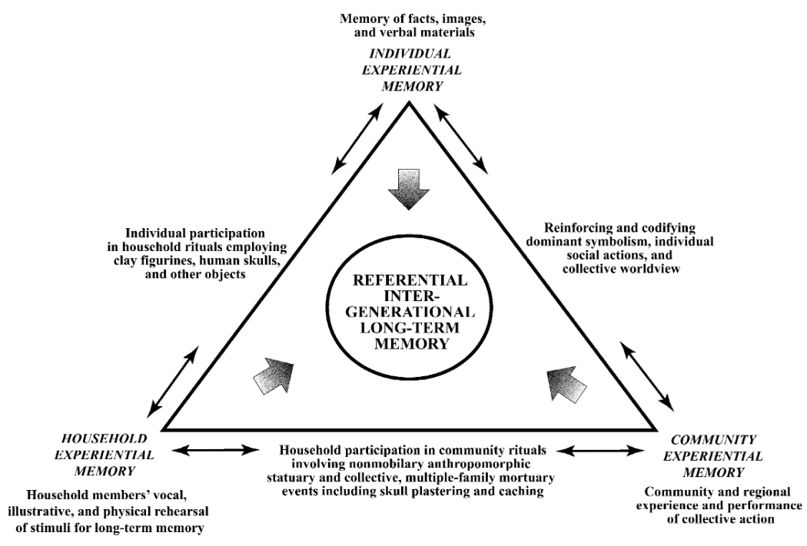

```{r libfuncs, include=FALSE}
library(tidyverse) # to pipe (%>%) and map across each file
library(purrr) # for mapping across files
library(renv)
library(tibble)
library(dplyr)
library(readr)
library(ggplot2)
library(flextable)
library(officer)
library(mortAAR)
library(ggthemes)
source("./demography_scripts/functions_MortDem.R")

```

```{r setup, include=FALSE}
source("./demography_scripts/functions_MortDem.R")
knitr::opts_chunk$set(echo = FALSE, warning = FALSE, message = FALSE, results='hide', cache = TRUE, fig.align = "center")
setwd(rprojroot::find_rstudio_root_file())
set.seed(42)

```

```{r renv, include=FALSE}
renv::restore()
renv::snapshot()
dependencies_list <- renv::dependencies()
renv::record(as.list(dependencies_list$Package))

options(readr.show_col_types = FALSE)

```

\frontmatter\pagenumbering{roman}
\newpage

# Acknowledgements

Writing a thesis, much like raising a child, is the work of an entire village. While I may have been responsible for research and writing, this endeavour would not have been possible if not for the support of a whole range of amazing and lovely people. I would like to thank all my friends for ensuring my sanity and physical health through weeks of consecutive night shifts. Thank you as well to all my proofreaders: Rhea Priel, Luise Sterzl, Merle Schlick, Pauline Engqvist&Carlos, Eva Jendreck, and Jess Rakblad. I must explicitly commend Eva Jendreck’s inspiration for the choice of Tolkien reference in the thesis title – result of a lengthy brainstorming session on a rainy autumn evening.

The support my family has given me continues to be the foundation of all my endeavours and I am eternally thankful for their love, appreciation and patience. Thank you to my dad for all his advice and to my mum for her continued excitement regarding anything (pre-)historic.

Thank you, with all my heart, to the women in my life.

I wish to express gratitude to my supervisors for allowing me to take on this topic for my thesis. Specifically, I thank Michael Meyer for all our insightful and though provoking conversations in Moldova whether directly pertaining to the topic at hand or spanning broad scales of archaeological theory. Enrico Lehnhardt’s introductory lecture on the Iron Age sparked my persisting love for anything broadly first Millenium BCE and his detailed feedback on term papers and now our discussions on enamel brooches and social stratification have unquestionably shaped the outcome of this research.

Special thanks are extended to Piotr Łuczkiewicz and Jes Martens for access to in-print or in-preparation material, as well as to Janina Lamowski for access to her unpublished master’s thesis.

My deepest respect lies with migrants of today, and the volunteers and activists who fight to uphold humanity in face of structural and very concrete physical violence. Migration has existed, it exists, and it will exist. Any political pushback is mere ahistoric window dressing, blatantly revealing the racism inherent to our economic system and its political manifestations, whether national or supra-national.

\newpage

# Abbreviations

NL: Neolithic

BA: Bronze Age

PRIA: Pre-Roman Iron Age

RIA: Roman Iron Age

(prefix) L: Late

(prefix) E: Early

(prefix) M: Middle

JaNG: Jutish and Northern German / Jutland and Northern Germany

Ha: Hallstatt

LT: LaTène

PLC: Poieneşti-Lucășeuca Complex

(1): Catalogue number

\newpage
\mainmatter

# Introduction

Archaeology as a discipline has a long and complicated history when it comes to grappling with ‘cultures’, cultural change, and migration, both ideologically and methodologically. It is a field steeped in and born out of nationalist and colonial world views and has lacked clear and concise ways of analysing and differentiating forms of cultural interactions and their expressions in the archaeological record.[^1] Discussions and publications in this field of research are often politically charged, in many cases without acknowledging it. This is particularly true for German Iron Age research, historically oscillating between (proto-) Germanophilia stoked by fascist ideology and a reactive Celtomania in post-Second World War generations.[^2]

The term Jastorf Culture (German: ‘Jastorfkultur’) describes an ‘archaeological culture’[^3] of the Iron Age in Northern Germany, Southern Scandinavia, and Poland ranging from the middle of the first millennium BCE up until (shortly before) the turn of the eras.

Since this study is examining the Pre-Roman Iron Age of Northern Germany and Jutland, it seemed adequate to follow convention by shortening the period to PRIA and abbreviating the regions as JaNG, combining the two as JaNGPRIA. This deliberately unwieldy combination of letters is in no way not to be used as a replacement of ‘Jastorf Culture’. As will be argued, it instead seeks to leave that term and its connotations behind entirely as a fragment of the history of research.

```{r fig.cap = "Research containing selected keywords, based on JSTOR indexed publications filtered by keyword 'archaeology' between 1870 and 2024. Dataset: constellate.org", fig.width=8, fig.height=4, dpi=120}
library(ggplot2)
library(tidyverse)
require(reshape2)
library(forcats)
library(paletteer)
library(readr)
library(png)

#colour
scale_colour_paletteer_d("MetBrewer::Greek")
scale_color_paletteer_d("MetBrewer::Greek")
scale_fill_paletteer_d("MetBrewer::Greek")
paletteer_d("MetBrewer::Greek")

#coords
coord_cartesian(ylim=c(0,100))

#data
term_frequencies_HoR <- read_csv("./jang_data/term_frequencies_HoR_BA_en1870_2024_tidy.csv")
publdata <- term_frequencies_HoR

#tidy long
long_publdata <- publdata %>%
  pivot_longer(cols = !starts_with("w"), names_to = "decade", values_to = "occurence")
  

#bar geom_text(aes(label=occurence), position=position_dodge(width=0.9), vjust=-0.25, size = 1, accuracy = 0.01) +
ggplot(long_publdata, aes(x = decade, y = occurence, fill=word)) +
  geom_bar(stat="identity") +
  scale_y_continuous(labels = function(x) paste0(x, "%")) +
  scale_x_discrete(limits=rev) +
  coord_flip() +
  facet_wrap(vars(word), strip.position = "bottom", ncol = 4) +
  scale_fill_paletteer_d("MetBrewer::Greek") +
  theme(axis.title.y=element_blank(), axis.title.x = ) +
  labs (fill = "", x= "", y = "", title = "Research trends in archaeological literature")+
  guides(fill = "none")+
  theme_minimal()
```

The aims of this thesis are twofold: To give an English language overview and summary of the broad history of research pertaining to the Jutish and Northern German Pre-Roman Iron Age (JaNGPRIA), as well as exploring different strands of current scientific discourses. Then to methodically explore demographical developments as a potential marker for migration in the funerary archaeological record and apply these considerations to JaNGPRIA cemeteries on a cross-regional level. Expectations for the sensitivity of the results are not particularly high due to the fragmentary standard of publication and the low number of osteological analyses conducted on cemeteries of this area and period. The hope is to shine a light on possible areas relevant for future research and to evaluate the usefulness of the methodology regarding migration phenomena. This fragmentary approach corresponds to D. Hofmann et al.’s heuristic view on migration narratives: “[I]nstead of attempting to delineate a singular narrative of any given migration event, we should accept the disconnected strands. An element of fragmentation or raggedness is characteristic of archaeological data and, we argue, more representative of the messy human underpinnings of this type of social process”.[^4]

On the topic of methodological limitations, the author wishes to disclose the boundaries of her own capabilities represented by a language barrier, leading to a reliance on German and English language publications, as well as select machine translations when it comes to PRIA research in Jutland.

The search for migration pattens as the topic of this paper has its origin in the migration hypothesis for the genesis of the Poieneşti-Lucășeuca material cultural complex in the Black Sea region, which will receive a brief presentation. Specifically, the present author seeks to explore whether demographic data of cemeteries in the selected area might provide new insights towards the validity of this theory. For reasons of scope, this will be done in the style of a case study– analysing only select aspects of the available data, as discussed in the relevant chapter.

Methodologically, this thesis will attempt to provide temporal depth to demographic analysis. Movement of people in the form of archaeological features first appears as a blackbox – it is uncovered archaeologically in the intermediate or terminal regions of a migration movement. The assumption of migration is then, ideally, traced through connecting regions, providing a more detailed image of object or feature distributions. It is however people who move and not objects[^5] and to reconstruct this human behaviour, one must then view the PRIA on human scales. This necessitates a relative chronological evaluation of the selected sites and regions through a harmonization of regional relative chronologies. A discussion of the feasibility of this endeavour and possible future research vectors will follow accordingly.

Structurally, the present author wishes to re-trace her research process by initially laying out the body of research which prompted this study, followed up by theoretical considerations and the constructed deductive interpretative framework, with the practical application on archaeological material following towards the end. These layers are not cleanly separated, theoretical and practical considerations will be interwoven throughout, for the sake of conciseness and intelligibility. They will however most prominently be brought together in the concluding discussion.

As an opening statement, the author would like to emphasise that the migration hypothesis and its connected areas of research provide an exciting impetus for further exploration of a region whose Iron Age has largely been viewed as stagnant, poor and heavily dependent on southern influences.[^6] Quite on the contrary, the Pre-Roman Iron Age from Jutland to the Black Sea is on the precipice of becoming a highly dynamic field of study, connecting international researchers and slowly breaking free from regional, political and methodological restrictions, hopefully awakening from deep slumber rejuvenated.

## On the migration hypothesis regarding the appearance of the Poieneşti-Lucaşeuca material cultural complex and the internationalisation phenomenon of the “Cremation Grave Groups”

‘Poieneşti-Lucășeuca’ (PLC) is a Late Pre-Roman Iron Age (LPRIA) archaeological material complex spanning parts of modern-day Ukraine, Moldova, and Romania. Internationally, PLC came into focus with M. Babeş´ monographic publication in 1993.[^7] Here, Babeş connected the genesis of PLC in the 3^rd^ century BCE (Seyer II b1/2, LT C2) to migratory movements originating in the “Jastorf area” in Northern Germany.[^8] The typological diversity of Jastorf style finds in the PLC area has led to an interpretation of the origins as polycentric and broadly situated between the Oder and Elbe rivers.[^9] J. Martens and F. Kaul expanded on this and proposed a “a corridor of contact between Denmark and the Baltic area in the north-west and the northwestern Black Sea area in the south-east”, based on a combination of similarities and distributions of material cultures and burial customs.[^10] In the same breath, they presciently posited reciprocal information and exchange pathways along this corridor, citing both the Gundestrup Cauldron, as well as an “early Przeworsk influence on the grave ritual of north Jutland” as evident material and ideological results in the source region,[^11] a “There and Back Again”.[^12]

T. Völling describes his Horizon I and II [LT D1-D2] as periods of cross-regional harmonization of material cultures,[^13] which manifests cross-regionally in neighbouring territories and relatively quickly takes on pan-European dimensions.[^14] Based on finds of Jutland-style material (Mecklenburg brooches and Jutland pins) outside of its primary area of distribution, J. Martens reaffirmed a previously[^15] proposed route of migration beginning in Jutland and continuing north into Poland.[^16] This stands in contrast to historiographically informed reconstructions of the “Exodus of the Cimbri”,[^17] positing a significantly earlier start for these movements compared to the usual date of 120 BCE.[^18]

Jastorf-style finds appear in modern day Poland in its western and lowland territories around late Ha, early LT, expand to Central Poland around LT B/C and arrive in Eastern Poland most likely around LT B2.[^19] The close chronological proximity of material types in some Polish areas around the Oder estuary, as well as continuous spatial mapping of certain types between the two regions could be a sign of intensified affinity with groups across the river.[^20] In Ukraine the formation of the emerging Zarubincy material complex which bears significant foreign influences, appears to be situated in LT C1b.[^21] The amalgamation of Jastorf/Preworsk/Oksywie/Zarubincy styles and customs is summarized in the term Northern and Eastern Central European Cremation Grave Groups, here shortened to just Cremation Grave Groups (CGG).[^22]

The spread continues in PLC areas in LT C1b – early research, as the two eponymous cemeteries suggest, was based almost exclusively on funerary contexts.[^23] These cemeteries show strong similarities in grave goods and burial customs to the CGG horizon and differ greatly from burial places of the previously dominant “Geto-Dacian” (GD) type. It was thus assumed that a drastic expulsion of previous populations had taken place as part of these LPRIA migratory processes.[^24] Today, settlement archaeological research is in the process of clarifying and diffusing this stark picture. PLC settlements do indeed contain CGG style material, but they additionally show affinities with and/or evidence of imported material from the Greek area of influence and the LaTéne(LT) area, as well as displaying a continuation of local GD style material culture.[^25]

The chronological order of CGG material spread then accordingly roughly presents in the following order: Jutland and Northern Germany – Ha D2; Western Poland – Ha D2/D3; Lowland Poland – LT A; Central Poland – LT B/C; Eastern Poland – LT B2/C1; Ukraine – LT C1b; Romania/Moldova – LT C1b/C2.

# Theoretical and methodical considerations

The topic of this thesis and its methods touch upon a variety of phenomena which require a deductive theoretical approach. *Migration*, as mentioned in the introduction, has seen a recent resurgence within archaeological research, largely due to a ‘Big Data hype’[^26] but also because of previous theoretical concerns and (perceived) methodological limitations. *Society and culture* are fascinatingly multi-layered terms, each with their own set of problems and connections to the history of research, with “*societal change”* reaching into the realm of politics and ideology of past societies. “*Demographic developments”* contains both the set of methodologies contained under the umbrella of “Archaeo-Demography”, as well as the issue of chronology and chronological systems in archaeology, which will receive more discussion in a separate chapter. The methods connected to this approach themselves then open up important discussions on *sex/gender* categories and their designation in archaeological practice. Only a quick glance will be dedicated to each, as a comprehensive survey could well encompass a lifetime of research.

It was attempted to order these considerations in order of scales from macro to micro, though there naturally are overlaps and inter-dependencies.

## Societies, social structure, and social change

On our journey through scales, we might first set out to ask, “What is a society?”, “How is it organised?”, and “How does it change?”.

For answers, we may turn to C. Tilley’s aptly titled “Social formation, social structures and social change”.[^27] Here, the author lays out a multi-level model of social analysis, born out of the conflict between individualist models and systems theory. What is a society? Social structures, an assemblage of individuals, surely, but not “as they please”.[^28] Rather, Tilley poses, they “depend upon the activities of individuals but have different properties. They are for the most part the unintended results of the activities of individuals”.[^29] Social structures then are “dialectically related entities”, their internal causal pathways “the existence of a structure through its effects”.[^30] However abstract this may sound, it is quite effectively visualised by Jepperson & Meyer (Fig. 2). In effect, it means that the different levels of social structures reflect back on each other constantly in complex, interwoven ways with the structure manifesting physically in the effects of its actors: “[h]igher-level processes are currently stable emergent configurations of lower-level ones; these configurations then themselves have causal powers”.[^31] The reproduction of a social structure is ‘caused’ by individuals which are at the same time ‘caused’ to reproduce it by that same social structure through an imbued *habitus*.[^32] Herein then lies the dialectical contradiction through which social change emerges through *social action,*[^33] even further it means that “[t]he seeds of change are always present within social formations in that the structures which characterise them are a unity of oppositions, chronically subject to change through structuration”.[^34] When contradictions heighten, social change emerges, often as a slow process but in periods, “where clashes of interests become discursively available”, it can occur rapidly.[^35] Institutional elements of a social structure may vary in transigence and persistence. Modern nation states and their codified laws with auxiliary executive branches present the furthest extent of this spectrum, while some prehistoric societies *might* have codified aspects of their culture in traditions, which were passed on orally through designated persons.

{width="550"}

Emergence and emergent properties then are of quite concrete archaeological interest.[^36] We see social change at its material emergence and from thereon set out to explore the processes of the complex systems it is situated in. However, the archaeologically observable (material) effects of this change are embodied ideology, subject to filters of abstraction, through which we then attempt to re-abstract multiple layers of the social construct in question.[^37] If layers of a higher abstraction then have emergent properties, they may be extremely difficult to reconstruct and their embodied effect difficult to quantify. Practically this issue often arises in the context of conspicuous monumentality. Is an increased materiality of burial markers really indicative of an increase in social stratification at the time of burial? Or is it rather an expression of the need to *display* social stratification and thus a sign of instability?[^38] This exemplifies quite well that to understand social change, we must look for its ‘seeds’ diachronically and not confuse the effects of change with its causes.

The preceding considerations may be summarised (as a variation on L. Hedeager) as follows: Social structures and their transformations (social change) are situated in larger systems. Social change within a social structure consequently affects surrounding social structures and the larger system they are embedded in. Social reproduction of a social structure is conditioned by higher level processes, a supra-social system. The subjects and objects of this social reproduction, imbued with a habitus, might have little awareness or control over this process until they engage in concrete social action. Social action emerges as the consequence of contradictions within a social structure and is carried out by conscious or unconscious subjects. Social change can only be explained diachronically, as the contradictions begetting the tensions leading to change amount over time and levelling mechanisms might mediate tensions for an extended period.[^39]

## Migration as a concept, in archaeology, and in the archaeological record

Archaeology has taken a long time to warm up to migration theoretically and methodologically, but it has seen a surge in popularity since the 1990s (Fig. 1), in close connection with its thematically linked but ultimately more versatile partner, “identity”. It comes as no surprise then that one of the seminal publications connecting migration theory and archaeology, D.W. Anthony’s “Migration in Archaeology: The Baby and the Bathwater” was published at the start of that very decade. Here, the author traces archaeology’s reluctance of engaging with migration and mobility, citing “(1) a bias toward methodological approaches to the problem; (2) rejection of a century of migration studies by demographers and geographers; and (3) a paralyzing fascination with the causes of migration”.[^40] Subsequently, the field has seen a ‘boom’, decisively stimulated by but not restricted to the “archaeogenetic revolution”.[^41] Theoretically, recent research has sought a more intimate connection with other social sciences, as well as ethnological approaches to migration, creating flexible multi-scalar interpretative frames, which the present research hopes to employ.[^42]

Migration has been defined in numerous ways, modern definitions often reflecting the post-bourgeois-revolution global order of nation states. These are not particularly useful for application in research of pre-modern peoples. Instead, a broad understanding of the term could prove analytically valuable, encompassing a wide range of experiences, processes, and (material) outcomes. Ideologically, especially in Europe, sedentism provides the “natural state” against which “migration” can stand in contrast, a state of habitation really quite recent on the scale of human existence. Often contrasted, at closer view *mobility* and *migration* might then not present themselves as separate phenomena but could instead be seen as two markings on the same scale.[^43] The goal here is to roughly capture the extent of what migration *could* be, instead of what we nowadays rather narrowly expect of it.

{height="50%"}

Central variables of migration (Fig. 3##) include composition, physical/cultural distance, and temporality, all of which can approach either end of their respective scale. For migration to occur, an impetus is required – classical models split this into push factors in the region of origin and pull factors in the target areas. However, as H. de Haas suggests, it might be more fruitful to seek this impetus in the categories of *capabilities* (and their constraints) and *aspirations*.[^44] It should be noted, that the *result* of a migration process does not necessarily reflect the initial intentions of the participating individuals or groups.[^45] Situating the CGG/JaNGPRIA phenomena within this model then poses a few challenges, as overly concrete designations of composition, temporality, and cultural distance and even physical distance would be presumptuous. However, as set out above, the diversity of the archaeological record and its chronological depth indicate a process composed of a *variety of groups*, a varying distance with the largest extent being either *extensive* or entirely *foreign*, a *to-ing* and *fro-ing* of unknown frequency potentially spanning centuries, and a cultural distance which might have ranged from well-known to totally unknown at the furthest extent. As settlement co-existence of groups with differing material cultures and funerary customs in Pomerania and the middle Oder region or material continuity in PLC settlements might suggest, mitigation of this distance could have occurred purposefully by migrants.[^46]

D.W. Anthony links diverse polycentric origins of a migration movement to a looser clan-based society, rather than a society tightly based on kinship, which would then apply to our area of research as indicated earlier by M. Babeș.[^47] “Clan” and “kinship” labels aside, the direction of the interpretation could well ring true. It seems clear that whichever interactions and mobilities have taken place, they were not restricted to one isolated local group but instead permeable. This does of course not indicate any specific form of social organization, but it may hint at an area in Jutland and Northern Germany largely free of strict boundaries and connected in mobile potential.

Waterways as pathways for short- and long-distance interaction and material exchange can be expected to have been an important aspect of mobile societies. They should be considered in further detail, as the concentration of enamel brooches around the Oder estuary and on isles north of it suggest.[^48] The close material affinities of groups across the Oder estuary and material finds on the German and Danish isles further show that navigating waters was well-established practice.[^49] They have been broadly discussed as routes of amber trade in the Northern Iron Age and as facilitators of the eastern expansion of Jastorf style material but might require reappraisal in the context of migrations.[^50]

Language is a significant factor in situations of contact and mobility. It is both an inhibitor and a facilitator of human mobility and interaction, as it can act as both a barrier and an intelligibility-continuum. On an individual level, it enables those who speak multiple dialects or languages to act as interpreters and mediators between different groups which they may or may not identify as affiliates of. Ethnographic observations indicate the agential potential for women and children in these positions, providing further detail to possible demographic effects.[^51] From a linguist perspective, J.T. Koch proposes that the development of Pre- and Proto-Germanic languages in the study area during the Iron Age lead to an increasing unintelligibility between Germanic and Celtic languages.[^52] The author links these changes to “cultural stress and economic decline” during the Late Bronze Age (LBA) to Early Pre-Roman Iron Age (EPRIA) transition, professing the former to have been “a time of stability — culturally and linguistically”.[^53] There can be no doubts about the efficacy and usefulness of the linguistic comparative method, however the application of its results may well be scrutinized. An overlap in research interests between linguists, historians, and archaeologists should come to no surprise, as it is merely the sources in which they differ – an interdisciplinary approach stands to reason. Koch is particularly involved in this regard, being one of the forerunners of the “Celtic from the West” hypothesis. It proposes a developmental split of the Celtic languages in the Iberian Peninsula, diverging from the previous Hallstatt and LaTène centric “Celtic from the East” model.[^54] From an archaeological perspective, it should need no repeating that “[n]o single material ‘culture’ can be associated with [“ethno-linguistic Celts”], and there is no prima facie reason why we should expect one to do so. The relevant material ‘cultures’ are so varied as to cast doubt on the coherence of ‘Celtic archaeology’ and ‘Celtic art’. […] ‘Celtic’ is rightly regarded as a misleading label for the central European Hallstatt and La Tène material ‘cultures’ of the Late Bronze Age and Iron Age […]”.[^55] And just as it is clear that material culture and language are not tightly linked cultural markers, it is also apparent that languages are not monolithic either and that back-tracing language changes and etymologies merely presents fragments of those aspects of language that did survive in some form. Language is after all just one aspect of culture, just as polycentric, ever-changing and flexible as any other, and most importantly subject to social negotiation and interaction. Its scientific reconstructions may or may not represent historical realities, but they cannot claim certainty.[^56] Attempting to reconcile multiple layers of prehistoric ‘culture’ is a worthy cause but it must be done with the utmost humility towards heuristic uncertainties. Boisterous grand narratives run into the danger that “several reasonably probable assertions are progressively based on each other, each bringing their own disciplinary problems of method and theory, the degree of probability that the model is correct decreases with each step”.[^57] Despite these cautionary words, language remains an incredibly important part in any understanding of human mobility and interaction and further research into this aspect of JaNGPRIA societies could be immensely valuable.  

While to modern eyes, past migration often appears as a catastrophic event, a cascade of disruptions and discontinuities, it may well be that affected groups experience it quite differently.[^58] Catastrophic weather or climate, large scale war, or political banishments are all conceivable and historically attested but they are surely only the most extreme examples (and partially quite modern developments).[^59] Instead migrations are seldom “simple” cause and effect but may present rather as a series of increasingly synergetic and sometimes antagonistic events, involving individual and group agencies, culminating in a tipping point at which capabilities and aspirations of groups or individuals allow for migration to proceed.[^60] In certain cases this dynamic may even bring forth a superstructural effect, such as a “culture of migration”, in which soaring aspirations of a group, lacking in significant constraints on its capabilities, unwittingly reify desire into traditions.[^61] This has a reinforcing effect on existing migration systems but it also touches upon aspects of socio-political organisation. Suddenly, as part of a society’s ideology, migration requires fulfilment and people involved with its upkeep accumulate further *social capital* due to their heightened profile and increasingly strong social ties.[^62] Consequentially, migration is a significant but subordinate part (Fig. 4) of social change,[^63] creating a secondary political space with its own negotiation mechanisms and positions of power,[^64] in reciprocal exchange with all its constituent social structures[^65] – it is “dynamically interlinked with layers of identity, such as ethnicity or gender, that were created, shaped or rearranged in the course of migration”.[^66]

Environmental factors influencing migration aspirations are generally plausible,[^67] though archaeologically difficult to grasp, as all *causes* are.[^68] Several authors have nonetheless attempted to engage practically with migration by connecting mobilities and the environment. B. Eitel evaluates the effect of aridisation in semi-arid settlement regions regarding technological innovation, migration, and human-environment systems. The author does indicate a marked stimulating effect regarding innovation, linked to adaptation and resilience strategies but urges readers to remain cautious, as these are *longue durée* processes, which only eventually might deprive societies of their means of existence, and not single catastrophic events.[^69] Another such long-term process might be described by N. Roymans for LPRIA Northern Europe (around LT C2 cont.). The author proposes long-term soil degradation and a successive adaptation in agricultural practices as a generator of aspirations for large scale settlement shifts and migration movements in the Lowlands. Evidence from Jutland and areas in Northern Germany indicate the possibility of similar effects, though poor dating remains an obstacle.[^70]

A further archaeological example is presented by M. Meyer’s habilitation thesis on the LPRIA to ERIA settlement of Mardorf 23. Here, the author makes the case for a method of migration pattern detection in the archaeological record. Mardorf 23 experiences Przeworsk-style material influences during its occupancy period. To explain this spread of material, Meyer traces cemeteries with funerary customs and material culture dissimilar (or foreign) to the area they are situated in all the way to the primary distribution area of Przeworsk-style finds.[^71] This distribution appears as isles, leading the author to interpret this phenomenon as a step-wise migration process with local cultural interactions, with the isle pattern being indicative of the earlier phases of migration.[^72] The factor of ‘distinctness’ in material culture and burial customs reveals a major limitation to which kind of mobilities we might identify through the archaeological record: only that which manifests as ‘other’.

Regarding the demographic composition of migrations, it should be noted that “[m]igration tends to be age structured, with people in their early twenties together with their dependent infant offspring exhibiting the highest mobility and hence the highest probabilities of migration”.[^73] D.W. Anthony remarks that ethnographic evidence suggests a role of “young adult males as scouts” with the result that “[t]he sex ratio of the initial migrant stream is heavily unbalanced towards males”.[^74] While this pattern is worth looking out for, it must be mentioned that this presents just one possible migration structure among many. Increasingly detailed evidence of mobile women is constantly emerging,[^75] and it stands to reason that women in the past were mobile in ways that men were not.[^76]

## “Culture” and clarification of the interpretative frame

Dealing with these complex and multi-faceted matters requires a precise approach and a good understanding of the categories and sources we as archaeologists are working with. As a fundamentally heuristic field, there needs to be an awareness of when and informed by which biases we are extrapolating. Our sources are primarily finds and features, secondary information extracted from or observed in them (such as 14C data, anthropological or zoological osteo-analysis, aDNA analysis, etc.), and historical records. What we would like to talk about in our research as a cultural science, one might dare to generalise, are past societies and their cultures – in fact, we do not just wish, we boldly define ‘cultures’ based on the archaeological material at hand. There is little point in re-treading old ground in the ‘culture term’ debate, as the fronts are hardened and the relevant arguments have laid fallow for over 30 years.[^77] Instead, the present author chooses to firmly endorse M. Furholt’s conclusions: “Overall, the concept of archaeological cultures has been utterly deconstructed time and again […]. Yet, many scholars […], probably the majority, claim that it may be possible to maintain the archaeological culture as a useful heuristic tool for classification, stripped of its ideological connotations. This has now, I would argue, terribly backfired. The ideological baggage of the archaeological culture is so strong that it continues to contaminate the archaeological discourse today”.[^78]

H. P. Wotzka admonishes that an abandonment of archaeological cultures must not be a mere change of terminology (explanans) but a fundamental replacement of what and how it is being studied (explanandum).[^79] In context of another 30 years of inaction, this may well be read as a surrender, an impossible and futile task – what do we study if not material culture and what do we wish to interpret if not the non-material culture of the people who possessed it? In this thesis, the present author hopes to show that separating the layers of analysis that ‘material culture’, ‘non-material culture’, and ‘people’ represent can actually come rather naturally and that research questions are perhaps more interesting when one is not concerned whether Midtjylland represents ‘Jastorf proper’ or just a ‘Jastorf periphery’. 

Concerning the nationalist element in research, the author wishes to emphasise that ethnic interpretations on top of this construct are scientifically objectionable and politically concerning.[^80] Archaeology is neither apolitical, nor is the individual tendency to not engage with narratives that might be deemed political, a neutral one. It is at best, an obfuscation of one’s own biases and at worst it cedes the space for archaeological narratives to ill-intentioned actors. The past has always been usable, whether it be as political propaganda, folk tale, resilience strategy, or for artistic purposes.[^81] Past never just is, it is constantly constructed and contextualised[^82] and it must be part of our professional responsibilities to partake in this consciously and with scientific rigour.[^83] Archaeology tells us very little, but archaeologists themselves can say a whole lot.

“Social Archaeology of traditional societies is Anthropology or nothing”, J. Brandt leads his doctoral thesis with this modification of the popular G. Willey & P. Phillips quote.[^84] While a bold rejection of a research paradigm representative of ethnonationalism and scientific ignorance, it also displays a curious concession. What is the significance of these additions? What is Archaeology if not social? Without humans, archaeology is nothing – thus it necessarily makes assumptions about (parts of) their lives and behaviours and seeks to interpret (aspects) of them. As such, all archaeology is social and neither the existence of an arbitrary subdiscipline called “Social Archaeology”, nor the (hypothetical) ignorance of some researchers in other subdisciplines change this. Further, which traditional societies?[^85] Yet another ill-defined and ambiguous term at best or an expression of colonial practice at worst.[^86] As is stands, it remains true in both the affirmative and admonitory sense that ***archaeology is anthropology, or it is nothing.***

## Cemeteries, deathscapes, remembrance, and identity

Cemeteries are structured assemblages of multiple burials. They are at once a profane practical necessity, an expression of social relations and structures, and spiritual spaces.[^87] Funerary rites and their ultimate expression as burials are situated in a field between self-perception, social rules, and external perception, manifesting as social practice, which, undergoing taphonomic filtering, becomes archaeological substance.[^88] As they theoretically may encode every layer of a social structure, burials are an essential source of social archaeological studies. The structure of a cemetery may relate to relationships between different groups within a burial community, while individual graves can represent identity and social role of a deceased person. Further, cemeteries can be described as “a representation of collective memorialization”, they are spiritual places of remembrance and commemoration.[^89] Their remains materialise the “dialectic of remembering and forgetting as social processes” and their structure may indicate “four main aspects of the community: the environment, the economic structure, the political ideology, and the society’s religious inclinations”.[^90] Remembering may further be embodied through heirlooms, particular objects inherited throughout generations. They serve as memory signifiers,[^91] through which remembrance becomes portable, and belonging is made visible.[^92]

Social structure in forms of vertical and horizontal stratifications *may*[^93] manifest within cemeteries in various, sometimes subtle, ways. Monumentality has been mentioned as the most immediately obvious signifier of social stratification or as a reaction to instability in a social structure. In some periods, however, burial rites may rather put an “emphasis on playing down differences rather than stressing them”.[^94] Additionally, cemeteries may be chorologically structured. These structures can represent chronological depth, burial groups relating to, among others, family or kinship, age, sex/gender, status and prestige.[^95] Grave goods may represent a socially negotiated and idealised version of the buried person and their position in society, which can be studied semiotically and statistically.[^96]

Cemeteries are communal spaces as part of landscapes at which “related communities make multi-dimensional and multi- scalar cultural statements about the dead and the living through the objects buried with the dead or used in the rituals, the building and topographical locations of the burial place, and the funerary and post-funerary activities”. As such they are a vital part for the social reproduction of societies and can be centres of political negotiation and identity formation, e.g. through ‘ancestor worship’ or other pre- and post-mortuary events, such as feasts, caring of the graves, or even secondary mortuary practices such as secondary burial or the reuse of physical remains.[^97] Burial landscapes or ‘deathscapes’ include the “deceased individuals and their associated burial items, […] the above ground remains of a plot, […] [and] the whole landscape of a burial ground, including the botanical remains, monuments, plot areas, walkways and roads, and structures” with the concept of ‘deathways’ encompassing “not just the emotion, ideology, or iconography associated with the mortuary context, but rather […] the whole of associated mortuary behaviour”.[^98] Further, the positioning of a cemetery within the landscape may encode various physical and metaphysical aspects of a society and as such, death and remembrance are then in some form tied to places, landscapes, and objects.[^99]

{width="600"}

The relationship between referential memory and experiential memories (Fig. 5) is not just a ‘drawing from memory’ but an *act* of re-integration and re-formation of that memory into the present – in this way then memory is “also a practice of remembering, embedded in the perception of the environment”.[^100] In such a view, lives, memories, and identities of people are deeply entangled with the landscape they inhabit, inseparable perhaps – “as Leach has put it, ‘kinship is geography’”.[^101] Meso- to macro-scale migration, i.e. peoples who move beyond their familiar landscapes and/or abandon their burial places then open up the question in how far their practice of remembering is disturbed, whether the link between referential and experiential memories has been severed and whether their frames of references and identities are transformed. These questions tie back into aspects of social change, in the form of persistence of tradition, the stability of a social structure and identity (trans-) formation.

Here it is necessary to view the relationships between memory, meaning, and experience as transigent.[^102] The same ritual a few generations apart, involving the same objects and procedures and represented by the same material outcome, even situated in the same location, may represent entirely different experiences and meanings, and draw on an evolved referential memory. Time itself is a fundamental factor of forgetting and transformation of meaning, though the present author deems it reasonable to assume that shifts in location function as accelerants.

Abandonment of cemeteries may then be seen as starting the process of forgetting the last of the people buried within who were not yet forgotten. Abandonment of a region then starts the process of forgetting the relations between land and people, the structures of dwellings, the pathways leading to once means of subsistence and remembrance. The heirloom remains, its presence a memory signifier of people, relations, traditions, rituals, and landscape until the referential memory signified has been wholly supplanted and it only represents memory in the abstract.[^103] In a study of 19^th^ and 20^th^ century cemeteries in Greece, L. Tzortzopoulou-Gregory describes destruction or re-uses of graves within a cemetery as the end of remembrance of the buried person.[^104] In this cultural context, the upkeep of graves and the commemoration of the dead is a familial obligation in which the community bears no responsibility, thus the abandonment of a grave represents an inability of the deceased’s family to upkeep their duties, “for various reasons—including migration”.[^105] In this case, the local non-familial communities, then re-use the gravesite, in a manner described as “very noticeable and quite disturbing to an outsider”.[^106] The author here links an increased turnover of graves to population pressure, rapid development, and social change in the form of “the ‘deterioration’ of traditional commemoration practices”.[^107]

### Sex and gender in archaeology

Since demographic models and analyses make use of sex/gender categories and migration movements may be structured by age as well as sex/gender, a further elaboration of these categories is deemed necessary. Common academic parlance separates what the German language singularly refers to as ‘Geschlecht’ into a set of ‘sex’ and ‘gender’. ‘Sex’ is used to refer to biological aspects and ‘gender’ to refer to socially constructed and negotiated aspects, an ‘identity’.[^108] However, sex and gender are heavily intertwined, often fluid, and in any case not binary.[^109] The relationship of sex and gender might be most succinctly described by J. Butler in her seminal “Gender trouble” where she expresses that “the original identity after which gender fashions itself is an imitation without an origin”.[^110]

‘The Bathroom Problem’ presents an analytically useful modern analogy – bathrooms separated into “Men’s” and “Women’s” are a concrete materialisation of sex/gender ignorant of the subaltern groups it excludes, and those its societal expectations affect negatively.[^111] The lines of sex and gender blur so clearly when it comes to who is permitted to these sexed/gendered spaces and who is policed. A masculine presenting cisgender woman may well be hassled when using a “Women’s” bathroom and face abuse, while a feminine presenting transgender woman or a feminine presenting non-binary person who was assigned female at birth could go entirely unnoticed.[^112] Neither sex, nor gender here present clear-cut boundaries, even in a time where gender is part of a so-called ‘culture war’, a particularly extreme example of modern normativisation. One could argue that smaller, more integrated communities, as some might imagine ‘traditional societies’, could enforce a larger degree of social conformity. This however is contrasted by the context of mobility and migration this thesis is embedded in. Frontiers and migratory settings can indeed by exceptionally queer spaces, providing opportunities for transitory identities and permeable social categories, such as with the previously mentioned translators, or additionally exemplified by a plethora of queer stories from the westward colonisation of North America.[^113]

Why then do archaeologists continue to use sex and gender categories as if they were separate? Naturally, sexed/gendered aspects of societies are incredibly important and research into them can provide information about contrasts or similarities to modern gender relations. It is clear that a category of ‘women’ does exist, which is to a certain degree informed by biological bodily features. Women’s history and their role in societies and position regarding the patriarchy and its emergence are unquestionably fundamental questions for archaeology. But how do archaeologists go about this?

Archaeology seeks to find sex/gender in a variety of ways. Either through osteological approaches and DNA analyses or through the so-called ‘archaeological gender determination’ in which burial customs or grave goods are assumed to be sufficiently indicative of a person’s sex/gender.[^114]

While only one of these approaches is methodologically highly questionable, they are all error prone. Osteological analysis of cremated remains is a highly uncertain method and produces conflicting and contradictory results, subject to the responsible anthropologists’ biases.[^115] Furthermore, “morphological methods for estimating sex from the skeleton have tended to produced [sic!] a bias in favour of males”.[^116] The effects of physical labour and other environmental factors on XX-chromosome individuals might increase this tendency, especially in cremated remains. As such, physical anthropologists cannot clearly separate sex and gender either. Their own societal biases and inclinations, as well as those of the investigated person’s society factor into the analysis, meaning that sex and gender must always be thought together.

Several attempts have been made to ‘save’ the method of archaeological gender determination from the claws of its heuristic death. In some instances, authors have cross-checked results of archaeological and osteological analyses with varying results,[^117] in others, tree diagrams based on statistical co-occurrence have been used to reconstruct ‘male’ and ‘female’ groups of grave goods within cemeteries.[^118] While it is commendable that basic assumptions in archaeology are being subjected to methodological scrutiny, these approaches fall short in two ways. They are, for one, specific to their period and field of study, and, more importantly, they do not solve the issues of perception, expression, and normativisation/social conformity of this category in the archaeological record.[^119] They are at best an interpretative adjunct, and at worst a pseudo-objectification of subjective modern projections onto the past. In JaNGPRIA H. J. Karlsen in his work on the cemetery of Badow (11/12) makes it abundantly clear that anthropological and archaeological sex/gender determination, at times, lie in direct contradiction.[^120] When differing burial customs and cemetery chorologies based on sex/gender are proposed, this issues is of great concern.

While the criticisms brought forward might appear severe, none of this is to say that staying on a higher abstraction level of analysis, providing a *histoire structurale* has no merit. Archaeology is often at its most effective when assuming *longue durée* and *structural* perspectives. However there needs to be an awareness of what is lost, which stories might not be told, whether that be because they are lost to material filters or because researchers ignore what they do not know. If one pleads for maintaining diffuse and difficult analytical categories, such as sex/gender, in general, the follow-up question should always be: ‘to achieve what’?[^121] Again, archaeology is not situated in a vacuum, its research focuses and categories reflect back on broader society, thus the search for human diversity and subalternity is both heuristically relevant and politically necessary.

## Archaeodemography

Archaeological Demography, sometimes ‘Palaeodemography’,[^122] describes a field of studies and related methods seeking to analyse the sizes, compositions, and structures of past populations and the changes therein.[^123] Potential archaeological sources include settlements and cemeteries but also hoards, depositions, and sacrificial sites.[^124]

Archaeodemography seeks out to reconstruct prehistoric data with a wide range of methodologies. Spatial structures may for example be analysed using landscape approaches, such as site-catchment analysis, in which center, periphery, and buffer zones of a given settlement are evaluated in their environmental, economic, and cultural contexts through Geographic Information Systems. Burials, especially cemeteries are of particular interest when it comes to reconstructions of the composition of past societies. As noted above, they are not ‘mirrors of life’, but they do nonetheless reveal particular aspects of social relations and structures. Osteological analyses of human remains may enable reconstructing age and sex/gender ratios of a society. For these purposes, demographic calculation methods, such as that of Acsádi and Nemeskéri may be used.[^125] The validity of the application of demographic models to past societies has been widely and controversially discussed. Population size estimates appear especially unreliable in this case as they must assume a stationary burial society.[^126] Here migration then directly relates to demography in the sense that “studies of population structure and demographic change must incorporate migration, since at any given time, a population is defined by (1) the birth rate, (2) the death rate, and (3) the migration rate.[…] Migration is equally as important as birth and death in determining the structure of populations”.[^127]

Standard features of archaeogeographic analyses are life tables, presenting a reconstructed overview of the population makeup of a given burial society, which might then be further analysed to sex/gender ratios, growth and fertility rates, life expectancy, and further derived data.[^128]

While the minimal estimate nature of demographic methods is a clear limitation, it is less significant for the aims of this paper, as only relative changes are relevant for detecting migration patterns. Furthermore, selection bias can distort views of the archaeological record – different grave types, for example, are unequally likely to be detected and if they occur in a mixed fashion, the less openly visible types are often overlooked.[^129] While the JaNGPRIA burial rite is assumed to be fairly uniformly in the style of cremation graves, there is still considerable variation in the regional and individual manifestations of this standard. Other taphonomic filters (in the wider sense) will now find brief mention.[^130] The spectrum of detectable burials may be significantly reduced by destruction of near-ground burials through natural erosion or ploughing. Additionally, whenever a combination of cremation urn burials and un-urned cremation burials appear together in stratigraphic superposition, it can be particularly difficult to separate grave goods and human remains. Sandy aerobic calcium-deficient soils, which the people in JaNGPRIA regions seem to have preferred for settlement,[^131] corrode exposed bones significantly, leading to an almost complete decomposition of inhumation burials.[^132] A number of these inhumation burials have been recorded or discussed in JaNGPRIA cemeteries, such as Bochow, Jeserig, Brandenburg-Neuendorf, Wustermark, Blindow, and Dauer.[^133] The relatively low number of cemeteries that are fully excavated, published, and analysed with reliably modern scientific methods presents a heuristic challenge, further  increased by corrosion and patination of metal objects with limited restauration work having been done on Jastorf-style material.[^134]

## Towards a working model of migration and social change

Returning from this extended look at theories and methodologies, the findings can be summarised in a working model for the analysis of the discussed JaNGPRIA phenomena. Reversing the prior structure, it will be constructed upwards in scales.  

This working model of migration and social change is based on the principle of uniformitarianism[^135] and uses anthropological analogies for analysis, recognizing that past societal behaviours and structures can be understood through contemporary experiences and observations, with due caution. It adopts a flexible, multi-scalar approach, emphasizing diversity, heuristic uncertainties, and the need for flexibility in interpreting prehistoric migration, social change, and demographic shifts, all while acknowledging the limitations of available data.

At the smallest scale, the model focuses on individual and group mobility. Migration is driven by individuals’ aspirations and capabilities, with people migrating for better living conditions, access to resources, or opportunities for social and economic advancement. Social networks, landscape knowledge, and linguistic abilities are crucial in facilitating migration, though migrants may not fully anticipate the temporal or spatial extent or the cultural consequences of their movements. The model emphasizes that migration becomes possible when aspirations outweigh constraints, enabling groups to engage in cultural exchanges.

At the social scale, the model examines cemeteries as central to understanding social reproduction and cultural interaction. Cemeteries reflect identity, social roles, and kinship, and may reveal the impact of migration through the introduction of new burial practices and material culture. The organization and material culture within cemeteries may indicate shifts in social stratification or the emergence of new groups, mapping interactions between migrants and resident populations. Through cemetery data, continuity or disruption in cultural memory can be traced, reflecting broader social dynamics.

The model recognizes that sex/gender are fluid, socially constructed, and context-dependent categories. While often viewed as fixed in modern contexts, these categories were likely more dynamic in prehistoric societies, especially in migratory settings. Migration impacts gender roles, as these categories may shift or adapt within new social environments. The model challenges rigid distinctions and highlights the agency of all genders in migration, with fluid or shifting gender dynamics reflecting broader social transformations and power dynamics within both migrant and host communities.

At the societal scale, the model explores how social structures emerge and evolve in response to migration. Social structures are seen as emergent properties that are both shaped by individuals and influence future behaviours, including migration. Migration also facilitates cultural transmission and exchange, driving the spread of material culture, ideas, and cultural practices. These exchanges are not one-way; rather, they are reciprocal, with material goods and ideas flowing in both directions, creating hybrid identities and social configurations that affect both migrants and host populations. The CGG horizon is seen as a multi-scalar migration phenomenon, marked by significant temporal depth.

At the macro-social level, the model frames social change as both a consequence and a driver of migration. Migration-induced social change often arises from contradictions within societies, such as economic tensions, resource struggles, or power shifts. These tensions, when exacerbated by migration, can lead to social restructuring and the emergence of new social configurations. Over time, migration may reshape social roles, political structures, and power dynamics, leading to the formation of new identities and the redefinition of social roles in both migrant and host communities. This process is dialectical, as contradictions within social structures are resolved or exacerbated by migration.

At the demographic level, the model incorporates archaeodemographic methods to understand the impact of migration on population dynamics. Cemeteries, osteological remains, and material culture are analysed to reconstruct past populations’ demographic structures. The model underscores the importance of migration in shaping population structures, with migration often driving changes in age distribution, sex ratios, and life expectancy. Migration can lead to the disappearance of parts of a society, or the introduction of new groups, which influences demographic processes.

This working model then offers a multi-scalar, flexible, and anthropologically informed framework for interpreting migration and social change in the Pre-Roman Iron Age of Jutland and Northern Germany. By considering the complexities of individual mobility, cultural transmission, social structures, and demographic change, the model provides a way of analysing the archaeological record in relation to the processes that shaped prehistoric populations, while acknowledging inherent uncertainties and limitations.

# The Jutish and Northern German Pre-Roman Iron Age (JaNGPRIA)

The area in focus is situated in lowland regions, north of the Central German Uplands. For this study, western-most cemeteries in Northern Germany have been excluded, due to the presumed eastward direction of the migratory movements. Though the situation on this excluded area and to connecting regions might provide an interesting future research vector.   

## History of research

Gustav Schwantes was the defining researcher of Northern German Pre-Roman Iron Age studies – it was Schwantes who coined the term ‘Jastorfkultur’. Trained in ethnology, geology, and botany, Schwantes was a native of the Lüneburg region where, in his youth, he encountered the cemetery of Seedorf, Kr. Uelzen.[^136] Based on further finds in eponymous surrounding cemeteries, he eventually structured the Northern German PRIA into the phases of Wessenstedt (LBA), Jastorf (EPRIA), Ripdorf (MPRIA), and Seedorf (LPRIA) – most importantly, this synchronised the EPRIA with the late Ha stages instead of early LT.[^137] As early as 1908, Schwantes classified the Jastorf groups as Germanic, situating them as part of the ‘prehistoric German homeland’, aligning his research with ethnic interpretations in archaeology in the vein of G. Kossinna’s ethnonationalist ‘settlement-archaeological method’, which paved the way to Nazi-era blood-and-soil archaeology.[^138] Even after the war, in the 1950s, Schwantes still characterized ‘archaeological cultures’ as entities defined by a collective identity and definite external boundaries, aligning “archaeological culture” with “people”, not just out of opportunism but out of conviction.[^139] In the 1930s, eerily reminiscent of contemporary historical events, the area defined as ‘Jastorfkultur’ expanded throughout Northern Germany with Schwantes justifying this spread as a consequence of an “extraordinarily homogenous group”.[^140] In reality, the Northern German Pre-Roman Iron Age is anything but ‘extraordinarily homogenous’. This is evident in all relevant aspects of the archaeological record.[^141] The archaeological record rather presents itself then as a patchwork rug, a set of differing overlaps in funerary customs and material culture, polythetic in appearance.[^142] Continuing from Schwantes, research in the Northern German PRIA has historically heavily focused on cemeteries with efforts focused on settlement archaeology usually being constrained to spatial distribution analyses and lacking large scale excavations and publications of these settlements,[^143] though this is starting to change in recent years – in some part owed to developer funded excavations.[^144] Recent publications have focused on consolidating aspects of research, such as W. Künnemann’s 1995 history of research focused M.A. thesis,[^145] W. Budesheim and H. Keiling’s 2009 edited volume concerning the state of research,[^146] and J. Brandt and B. Rauchfuß’ 2014 conference publication which connects past and present issues with international perspectives,[^147] and most recently B. Rauchfuß’ 2018 review of attempts at regionalisations and models of cultural interaction.[^148] J. Brandt’s 2001 doctoral thesis on the relationship between ‘Jastorf’ and ‘LaTène’ requires separate mention – herein the author presents the first coherent attempt at a deductive anthropological interpretation of the Northern German PRIA, sweeping away almost a century of inductive and ethno-nationalist narratives, while at the same time reversing the usual mediterranean-centric explanatory model for JaNGPRIA social change.[^149] A decade has now passed since the last major cross-regional and inter-disciplinary publication, research has since returned to focussing on select areas or topics concerning the Northern German PRIA, exemplified by H. Keilings collected contributions towards a regionalisation of Westmecklenburg,[^150] B. Rauchfuß’ analysis of landscape and settlement patterns in Vorpommern,[^151] S. Burmeister’s and M. Gebührs overview of demography in Iron Age societies,[^152] and H. Steuer’s reassessment of ethnic interpretations and the applicability of the ‘Germani’ identity (ger. ‘Germanenbegriff’).[^153] Recently, two major publications on sites of significant interest have been completed: Mang de Bargen (8), a burial complex with grave assemblages spanning the BA to PRIA and EPRIA to LPRIA transition and Mühlen-Eichsen’s southern funerary group (9) – sadly an inclusion of the latter was not possible in time for this thesis.[^154]

Jutland’s inclusion in a study concerning the Iron Age of Northern Germany might at one point have been controversial, as, while it’s undisputed that the southern part of the peninsula displays noteworthy affinities towards adjacent Northern German regions, an integration of northern Jutland into this interpretative framework has historically been meet with fierce opposition by Danish archaeologists.[^155] Naturally, ‘integration’ and ‘interpretative framework’ in this case are euphemistic for subsumption into the ‘Jastorfkultur’ by German researchers in light of the Second Schleswig War and the German occupation of Denmark during the Second World War. Of course, now, ‘Jastorf’ is dead just as ‘culture’ is dead by a thousand cuts and despite noted dissimilarities between the Iron Ages of North Jutland and Northern Germany, they are clearly part of a ‘corridor of contact’. A look at the history of PRIA research in Jutland produces a slightly different image than in Northern Germany. An initial assessment of the Danish Iron Age occurred in the broader context of O. Montelius’ work on the ‘Nordic Iron Age’ at the end of the 19th century.[^156] S. Müller’s contemporary publication[^157] contains a “phasing of the Iron Age which in essence is the same as the broad phasing within which we still work today”.[^158] South and Mid-Jutland’s PRIA has prominently been evaluated and chronologically structured by C. J. Becker in 1961.[^159] For Denmark as a whole, L. Hedeager has analysed social change and the emergence of social stratification from the PRIA to the early Middle Ages (Germanic Iron Age), methodologically situated in a post-processualist and structural-Marxist tradition.[^160] Her work is contrasted and expanded upon by L. Webley with a focus on households in the PRIA to ERIA through the lenses of *practice theory* and *structuration theory*.[^161] Settlement excavations and publications thereof are more prominent and complete the picture provided by other find types.[^162] J. Martens and F. Kaul must be mentioned as important contributors to an international research meaningfully connecting Danish and German traditions.[^163] In recent years, research crossing the border has found revived interest, institutionally manifested in the URNFIELD network, a partnership of the Center for Baltic and Scandinavian Archaeology (ZBSA) and the Museum Sønderjylland.[^164]

Social-archaeological interpretations of the JaNGPRIA area as a whole or for individual regions have varied significantly. German language research has been categorised by J. Brandt as largely inductive and historiographically informed – as such it tends to be highly subjective and Mediterranean-centric,[^165] reflecting more the biases and ideologies of past and present authors instead of offering a critical and informed perspective on past societies.[^166] The LBA to EPRIA transition is often categorised as a time of crisis, a breakdown of prized connections with southern contacts. Continuities in material, ritual, and settlement are seen as happening ‘in spite’ of this, while changes are emphasised as signs of this crisis.[^167] Historically there has been much discussion on the autochthonous status of the genesis of the Jastorf groups.[^168] A popular interpretation viewed the beginning of Jastorf period settlement as a migration of ‘Germanic’ peoples from Scandinavia and a further intensification of archaeological finds during the Seedorf phase (1^st^ century BCE) as a second migratory movement, this time of the ‘Longobardi’.[^169] The socio-economic organisation within the area’s groups have been broadly categorised as egalitarian or as ranked societies within the framework of ‘chiefdom societies’.[^170] Correlating with views of a low level of social stratification, some research has depicted the EPRIA as a “as a seemingly peaceful period, although [in Jutland] it coincides with a peak in deposition of weapons and human bodies in bogs, the first fortified settlements, and the famous deposition of the Hjortspring boat or war canoe”.[^171] Various authors have repeatedly assigned JaNGPRIA groups a ‘Germanic’ group identity and ethnos.[^172] Select elements of the archaeological record have been interpreted as indicative of the later RIA system of retinue (ger. ‘Gefolgschaftswesen’) or further processes of state formation in subsequent periods.[^173] Once again corresponding to the south, the end of LT settlement in Southern Germany in LT D2 is at times connected to “southwards movement/expansion of germanic tribes into celtic territories” expanding from Jutland, Northern Germany and connected areas.[^174]

This overview is by no means exhaustive, a more thorough study can be found in W. Künnemann’s 1995 article on Jastorf history of research,[^175] as well as in H. Keiling’s updated elaboration on the state of research.[^176] A further comprehensive historical discourse analysis with focus on specific areas of narrativization would be of great value, it is certainly noteworthy that a comparatively high amount of existing research has focused on developments that chronologically or spatially lie outsidethe JaNGPRIA, rather than within.

## Relative and absolute chronology

The issue of chronology lies at the heart of any discussion of migration and social change. In a cross-regional context, the question of synchronicity between multiple relative chronological systems becomes significant.

G. Schwantes based his chronological structure of the Lower-Saxonian Iron Age on the assumption that while LT style material culture was a defining influence, there must have been earlier Ha related southern connections, thus synchronising his Wessenstedt stage with the later Ha stages and Period VI as a transitory phase from Bronze- to Iron Age.[^177] The following Jastorf stage, before becoming eponymous of the entire Pre-Roman Iron Age within an area, was initially chronologically demarcated by the onset of Middle-LT brooches and triparted based on above-mentioned perceived developments in pottery typology.[^178] Some general tendencies in the development of pottery typology appear to still be relevant, despite significant regional variations.[^179] H. Seyer’s relative chronology for the Mittelelb-Havel region is based on non-statistical comparisons of object-combinations in closed finds.[^180] Seyer follows a bipartite system of EPRIA and LPRIA akin to Schleswig-Holstein, Mecklenburg, and Altmark. Jutland’s relative chronology has been suspected to significant changes and differences. Most significantly, it was initially triparted by O. Montelius and C.J. Becker.[^181] A bipartite system was adopted by both J. Martens and C. K. Jensen - all schemata still hold relevance in modern research. Applying a two-tiered chronological system to the southern periphery has proven unsuitable,[^182] H. Seyer argues this is due to LT influence and that the MPRIA transition merely represents a gradual shift, while in the north, the EPRIA to LPRIA transitions manifests at the onset of the second half of the LT period.[^183] This difference is further exemplified regarding expansion of LT material, as LT A finds are rare in northern areas.[^184]

To compare cemeteries in different regions using a variety of relative chronological systems depending on the period they were excavated in as well as individual preferences of the responsible researchers, a harmonization of relative stages is necessary.

R. Heynowski attempted such a harmonization for the Early Pre-Roman Iron Age by analysing distribution and typological change in torcs (ger. Wendelringe), as they are a relatively abundant, chronologically sensitive, and originate within the area.[^185] He thus defines three horizons, roughly corresponding to Ha D1/D2/D3, with the last slightly extending into LT A.[^186] Similarly, N. Döhlert-Albani structured the Late Pre-Roman Iron Age to Early Roman Iron Age into five horizons based on brooch distribution and typology. This method assumes that these LT brooches do not experience significant chronological variations in their secondary distribution area.[^187] He defines five horizons based on thirteen brooch types, some being confined to one horizon, some spanning multiple, ranging from LT C2 into the ERIA post-LT D2.[^188] The results of their attempts, while of significant value, exemplify the need for a revised cross-regional relative chronology. For the purposes of this study, the rough alignments provided by Döhlert-Albani and Heynowski, and, to some degree, Brandt and Völling, will be employed, with the acknowledgement of their insufficiencies.

Absolute chronological anchoring remains an issue.[^189] “[T]he 14C plateau c.750-400 BC[E], also known as the Hallstatt plateau […] has been detrimental to studies of Early Iron Age chronologies in Europe but also […] a later inversion of the calibration curve which inevitably yields multimodal distributions for samples formed in c.320-200 cal BC[E]” has led to a dependence on typo-chronologies and stratigraphic observations in JaNGPRIA research.[^190] Using Bayesian models, H. A. Rose and J. Meadows have suggested an earlier starting point for the Jutish EPRIA (7^th^ century BCE, Fig. 6), as well as a significantly earlier date for the EPRIA to LPRIA transition (late 4^th^ to early 3^rd^ century BCE).[^191] This represents a shift of approximately 50-150y and 30-70y respectively. For Mang de Bargen, Kr. Segeberg (8), Rose et al. date the LBA to EPRIA transition (Hingst Per. VI – IA) around the late 6^th^ to early 5^th^ century.[^192] This divergent development in nearby regions is rather noteworthy, though it must be restated that the beginning of ‘the Iron Age’ does not represent reaching a new civilisatory step, nor does it mean processing iron for the first time. Rather these divergences might be seen as the result of different regional BA influences and developments materially converging at a point where they become identifiably different from what previously existed. For Jutland specifically, the onset of the urnfield tradition marks, in the opinion of the authors, what is considered ‘Iron Age’. Conceptually, this does not necessarily impact harmonizations with other regions based on typochronology, instead it merely lengthens existing phases.[^193] Rose & Meadows view Per. VI as a significant period in the LBA and EPRIA transition where important material changes occur, although it remains unclear how far it overlaps with the early PRIA stages in Jutland or other regions.[^194] This lines up well with Heynowski’s harmonization who recognizes egregious differences in the length, start and end of Per. VI and surrounding stages and could well support G. Schwantes’ identification of Wessenstedt as a transitory stage.[^195] Whether one accepts Rose and Meadows’ revised PRIA start date is largely contingent upon individual definitions of ‘Iron Age’, since this is what the researchers are essentially challenging. Their model does not reveal an earlier dating of Jensen I.1 material, it instead subsumes LBA Per. VI finds from Aarupgaard (3) cemetery into the EPRIA. In principle, this could be a valid course of action, although a highly inconvenient one, considering the centuries worth of publications relying on established periodisation. The results from Mang de Bargen (8) and Møller et al.’s dates for Søhale, both in the second half of the 6^th^ century, are more sensible start dates for the EPRIA in the present author’s view.


While for now the chronological diversions appear manageable, they do emphasise the urgent need to “move beyond essentialized periodizations” and create flexible and materially relevant chronological frameworks.[^196] The (extensive) use of periodised absolute data as priors, as seen in some of the Bayesian JaNGPRIA papers is then at once unsurprising but ultimately statistically undesirable.[^197] The issue remains that chronologies of the JaNGPRIA whether relative, absolute, or in-between are in constant flux but a local contribution is beyond the scope of this work. Future research on localised material could well be further integrated with Bayesian techniques such as Hierarchical Chronological Modeling (HCM). Apart from H. A. Rose’s contributions, the possibilities of statistical methods in the context of chronology may be exemplified by the work of J. Lulewicz for the Mississippian period of northern Georgia (United States),[^198] and W. E. Banks et al.’s publication on the French Middle Gravettian.[^199]

However, for a broad analysis of cemetery occupancy dates where chronological sensitivity and precision is not necessarily required to detect patterns, the amount of synchronization reached through the subsequently laid out methodology will be deemed acceptable, though the statistical uncertainty in any converted or harmonized date must be stressed. This is in line with L. Hedeager’s remarks on chronological precision in *longue durée* observations: “An operational chronology in this case is a phasing which is sufficiently broad to allow as much as possible of the archaeological material to be located within its segments and which at the same time is sufficiently sharply focused for chronological variations in material culture to be detected”.[^200] In the name of transparency, all cemeteries and their original and harmonised dates, as well as all harmonised grave data is digitally appended to this study.

## Cemeteries, contexts and developments

Deathscapes of the Pre-Roman Iron Age in Jutland and Northern Germany vary significantly in their regional manifestations and change all throughout the centuries leading up to the start of the Common Era. JaNGPRIA cemeteries strongly vary in size, though estimates can only be treated as minima due to partial excavations.[^201] They range from less than a hundred to several thousand burials with the cemeteries of Årupgård, Groß Timmendorf, Leese, and Mühlen-Eichsen (9) counting among the largest,[^202] while Schwissel, Stockelsdorf-Mori, Hornbek (16), Langenbek, and Putensen (23/24) provide the highest amounts of published closed finds.[^203] The general frame of funerary rites within this area can be summarised as: predominantly cremation graves in cemeteries of varied sizes with varied forms of structuring features, often in reference to previous periods and without evident signs of multiple signifiers of social stratification.

As with any other part of the archaeological record, cemeteries and funerary customs differ greatly across regions. Groups within Northern Germany exhibit a variety of features. Continuations in BA-PRIA landscape use can be seen in Badow (11/12) where the cemetery overlies a BA fire pit line,[^204] a common structure of this period which, among others, M. Løvschal and D. Fontijn have cross-regionally linked to funerary ceremonies and interpreted as directional connections linking places and people, bringing communities together instead of acting as boundaries.[^205] There is evidence of singular burials outside of but connected to certain cemeteries.[^206] Fire pits were also common features of PRIA cemeteries, such as Bordesholm, Schwissel or Sörup II (5) where they are commonly associated with burial rites or post-funerary events.[^207]

Regarding cemetery location, it is often stated that “burial sites of the Pre-Roman Iron Age in northern Germany were preferably located on differing forms of slopes that descend to rivers and other lowlands”.[^208] M. Sopp contests this generalised view and situates their placement on flat knolls and dunes and explains the relation to rivers and bodies of water as contingent on settlement location.[^209] In light of B. Rauchfuß’ observations on distances between cemeteries, bodies of water and settlements (Fig. 7),[^210] this reduction appears insufficient. It seems clear that water had a significant meaning in the structuration of living and burial landscapes, whether it be as modes of exchange and transport or as physical and spiritual boundaries,[^211] not just in Vorpommern but also in western Jutland (Fig. 8).

{width="60%"}

```{r fig.cap="Distance of EPRIA urnfield cemeteries in western Jutland to select features. Data: Møller et al. 2020, S7.", fig.width=7, fig.height=6, dpi=300}
library(ggplot2)
library(readr)
library(tidyr)
library(dplyr)

distanceData <- read_csv("jang_data/west_jutland_cemetery_distances.csv") %>% 
  pivot_longer(
    cols = !starts_with("Site"),  # All columns that represent distances
    names_to = "Feature_Type",
    values_to = "Distance"
  )

ggplot(distanceData, aes(x = Feature_Type, y = Distance)) +
  geom_boxplot() +
  labs(
  #  x = "Feature Type",
    y = "Distance of cemeteries to... in km"
  ) +
  theme_minimal()+
  theme(
    axis.title.x = element_blank()
  ) 

```

Jutland’s PRIA saw the emergence of urnfield cemeteries, marking a significant shift from earlier burial practices. This transition began around the start of the PRIA, following the introduction of cremation, which had first appeared in the region around the end of the Early Bronze Age. Prior to this, cremation was already practiced in certain areas of north-western Jutland during the Bronze Age (e.g., Thisted), where about 10% of burials from 1500–1300 BC were cremations.[^212] The urnfield tradition in Jutland involved cremating the deceased, with their calcined bones placed in ceramic urns, often accompanied by metal objects. These urns were buried under small burial mounds (Danish ‘tuegrav’, German ‘Buckelgräber’) that were constructed using soil from surrounding circular ditches.[^213] These mounds typically ranged in height from 1 to 2 meters and varied in diameter, sometimes reaching up to 11 meters. Notably, these graves were surrounded by ditches, often interrupted by bridges leading to the central mound. The urnfields were primarily located in south-western Jutland, an area characterized by nutrient-poor, sandy soils and low-lying topography, with scattered lakes, rivers, and bogs. The landscapes were often used for burial mounds that demarcated major routes, continuing a Bronze Age tradition of marking significant pathways with burial sites. Nearly 90 urnfields have been recorded in the region. The urnfields themselves vary in size, with some containing up to 1500 graves. Each grave was carefully demarcated by a ditch, and the graves generally did not overlap, making stratigraphy difficult to interpret. However, some sites do show evidence of horizontal stratigraphy. A small percentage of graves also included unique burial types such as 'bone-layer graves' (German ‘Brandgrubengrab’) or 'urn-bone layer graves' (German: ‘Brandschüttungsgrab’) where burned remains are deposited in graves either without an urn altogether or in addition to the urned remains. Unlike in some other JaNGPRIA regions, burned remains of the pyre do not appear in graves systematically and, when present, are reduced to small quantities.[^214] Additionally, there is no significant evidence of cremation pyres near the urnfields, although pyres may have been covered after cremation, making their identification challenging. Cremation graves may additionally appear “in isolation, or in small groups” and even as “secondary burials in [BA] barrows”.[^215]

The LPRIA in Jutland displays a tradition of burying infants inside of settlements.[^216] Settlement burials might have been an aspect of the Northern German Iron Age as well, though chronological contemporaneity of respective burials and settlements remain undetermined.[^217] In an analysis of the urn cemetery of Schwissel in Schleswig-Holstein, T. Brock detects a proportional decrease of infant burials from EPRIA over LPRIA to RIA (33%, 24%, 12%), where some extraordinarily densely occupied areas within the cemetery with a tentative PRIA dating display a significantly increased infant and children mortality (41%, 67%). The author suspects a relative contemporaneity of the burials within these areas and notes that such features have not been observed in comparable cemeteries, which might indicate an exceptional catastrophic event. Beyond individual crisis, Brock illustrates similar decreases in infant and children mortality, especially in newly established LPRIA cemeteries in Schleswig-Holstein.[^218] While a decrease in actual mortality is possible, it likely does not hold all explanatory power and rather a shift in funerary custom similar to developments in Jutland. M. Sopp observes an immense concentration of PRIA re-occupations of burial places established in previous periods, with a focus on NL and EBA barrows, though LBA and EPRIA urn field cemeteries experience similar use on a smaller scale.[^219] In Northern Germany, secondary cemetery use of NL and EBA burial places is recorded for Putensen (24), Hornbek (16), Tostedt-Wüstenhofen (21), Ehestorf-Varendorf, Soderstorf (26),[^220] and Drögennindorf (25).[^221] In Jutland this link appears to be even stronger (Fig. 8) and association of EPRIA urnfields with barrows is more rule than exception.[^222] Secondary cemetery use of LBA and EPRIA urn fields is recorded for Gielow, Klein Hesebeck, Klink, Lottorf, Nienhagen, Randau, Schafstädt, Wachow, and Wahlitz.[^223] In Putensen 1B (24) secondary barrow burials have been shown to be a particular feature of the EPRIA to LPRIA shift.[^224]

The issue of sex/gender separated cemeteries has been broadly discussed in various regional and chronological contexts within the JaNGPRIA and ERIA. C. Eger has reviewed the evidence and summarises that archaeological and anthropological sex/gender determination often contradict each other. Further, repeated analyses of cremated remains by different pyhs. anthropologists using diverging methods produce disparate results. If and to which extend sex/gender separated cemeteries then exist remains a methodological issue that would require intensive interdisciplinary research.[^225] Initially suspecting a sex/gender separated burial practice, H. J. Karlsen regarding Badow (11/12) interprets unequal sex/gender distributions in parts of the cemetery as evidence of social stratification which (implicitly) only secondarily manifests in a sex/gendered manner.[^226] It is of further importance that very few cemeteries in this area are excavated up to their full historic extent which is why certain chorological features might get over interpreted. For Schleswig-Holstein, H. Schutkowski and S. Hummel posit a burial custom where cremation urns have age and gender specific selection criteria, which has seen some wider reception in cross-regional research.[^227] In Soderstorf (26), the osteological and chorological evaluation points towards a sex/gender and age structured organisation of burial groups and customs,[^228] which may just as well be a manifestation of horizontal social stratification.

It appears that in select cemeteries, the distance between urns decreases over time, especially towards the LPRIA and ERIA with burials frequently being disturbed by subsequent depositions. This is the case in Badow (11/12) beginning in RIA B1 and in Wachow starting around LT C1,[^229] though the disturbance of previous burials is not particular to the PRIA,[^230] the close chronological proximity does stand out. Börnicke (29) displays similar features of a shift towards a specific and densely populated part of the cemetery in the LPRIA, though unlike other cemeteries, people of previous periods already set their graves very close to each other.[^231] Sörup II (5) displays a disparate picture with burials across all of its periods being loosely distributed without destructively disturbing previous graves.[^232]

Badow (11/12) exemplifies chorological developments towards the LPRIA to ERIA transition, as towards the beginning of the latter, a chorologically separated structure develops which H. J. Karlsen interprets as reflective of settlement structures, i.e. surrounding ‘villages’, whose communities use the same area for interment while still keeping within their own structure.[^233]  

An interesting example of a potential occupancy hiatus is provided by the cemetery of Wachow, Kr. Havelland. Here we find a cemetery with seemingly continued use from late BZ to early RIA with all relative chronological stages accounted for.[^234] Indicated by a low amount of Jastorf IIa (r.c. Seyer [LT B2/C1]) finds, a Correspondence Analysis of chronologically sensitive material suggests a somewhat strong grouping of Jastorf Ia/b [Ha D3 – LT B2] types and a separate grouping of Jastorf IIa/b1/b2 [LT C1 – LT D2] types with a significantly less densely populated admixture of Ia/b [Ha D3 – LT B2] types connecting the two groups.[^235] Burials in Wachow appear to be “There and Back again”.

```{r include=FALSE}
library(ca)
library(devtools)
library(CAinterprTools)
library(cabootcrs)
library(readr)
library(ggplot2)
library(ggrepel)
library(paletteer)
library(extrafont)


#colour and text style
scale_colour_paletteer_d("MetBrewer::Greek")
scale_color_paletteer_d("MetBrewer::Greek")
scale_fill_paletteer_d("MetBrewer::Greek")
paletteer_d("MetBrewer::Greek")

font_import()
loadfonts(device = "win", quiet = TRUE)
choose_font(c("Consolas", "Cascadia-Code", "mono"), quiet = TRUE)

#read data as df
cadatawc <- read_delim("jang_data/CA Wachow cleaned+filled+noise removed.csv", 
                                                     delim = ";", escape_double = FALSE, trim_ws = TRUE)
#transform to matrix with first row as rownames
matrix.please <- function(cadatawc) {
  matrcadatawc <- as.matrix(cadatawc[,-1])
  rownames(matrcadatawc) <- cadatawc$Gräber
  matrcadatawc
}
matrcadatawc <- matrix.please(cadatawc)

#CA basic 
ca.fit <- ca(matrcadatawc)


#CA get variances
ca.sum <- summary(ca.fit)
dim.var.percs <- ca.sum$scree[,"values2"]
dim.var.percs

#CA plot data prep
ca.plot <- plot(ca.fit)

make.ca.plot.df <- function (ca.plot.obj,
                             row.lab = "Rows",
                             col.lab = "Columns") {
  df <- data.frame(Label = c(rownames(ca.plot.obj$rows),
                             rownames(ca.plot.obj$cols)),
                   Dim1 = c(ca.plot.obj$rows[,1], ca.plot.obj$cols[,1]),
                   Dim2 = c(ca.plot.obj$rows[,2], ca.plot.obj$cols[,2]),
                   Variable = c(rep(row.lab, nrow(ca.plot.obj$rows)),
                                rep(col.lab, nrow(ca.plot.obj$cols))))
  rownames(df) <- 1:nrow(df)
  df
}
ca.plot.df <- make.ca.plot.df(ca.plot,
                              row.lab = "Graves",
                              col.lab = "Types")
ca.plot.df$Size <- ifelse(ca.plot.df$Variable == "Graves", 2, 1)

#CA plot ggplot
p <- ggplot(ca.plot.df, aes(x = Dim1, y = Dim2,
                            col = Variable, shape = Variable,
                            label = Label, size = Size)) +
  geom_vline(xintercept = 0, lty = "dashed", alpha = .5) +
  geom_hline(yintercept = 0, lty = "dashed", alpha = .5) +
  geom_point()

#sizing and repel text
p <- p +
  scale_x_continuous(limits = range(ca.plot.df$Dim1) + c(diff(range(ca.plot.df$Dim1)) * -0.2,
                                                         diff(range(ca.plot.df$Dim1)) * 0.2)) +
  scale_y_continuous(limits = range(ca.plot.df$Dim2) + c(diff(range(ca.plot.df$Dim2)) * -0.2,
                                                         diff(range(ca.plot.df$Dim2)) * 0.2)) +
  scale_size(range = c(3, 3), guide = F) + 
  geom_text_repel(max.iter = 1000, max.overlaps = Inf, show.legend = F)


#values
#malinvaud(data=matrcadatawc)
#rows.cntr(data=matrcadatawc)
#cols.cntr(data=matrcadatawc)
#aver.rule(matrcadatawc)

```

```{r fig.cap="Correspondence analysis of chronologically sensitive material for cemetery of Wachow Kr. Havelland, labels represent graves and types; types categorised according to Buck/Buck 2019 and appended with relative chronological estimate (after Seyer 1982)", fig.width=11, fig.height=6, dpi=300}
#graph labels, colours, and upside down flip plus theme
p <- p +
  labs(title ="Correspondence Analysis, Cemetery: Wachow, Kr. Havelland", caption = "based on Stetzuhn 2023 Fig. 10, modifications in style only" ,x = paste0("Dimension 1 (", signif(dim.var.percs[1], 3), "%)"),
       y = paste0("Dimension 2 (", signif(dim.var.percs[2], 3), "%)"),
       col = "", shape = "") +
  scale_y_reverse() +
  scale_x_reverse() +
  scale_colour_paletteer_d("MetBrewer::Greek") +
  theme_minimal()
plot(p)
```

Regrettably, an initially envisaged osteological analysis of the cremated remains did not take place,[^236] and as such Wachow remains merely light evidence in the EPRIA to LPRIA shift. A strikingly similar development may be found in Putensen 1B (24) where after period Harck Ic [Ha D3-LT A] existing burial groups with their stone circle-centered structure do not see any further use. The following re-use starting in Harck IIa [LT C1 cont.] sees a drastic change in structure and customs, with burial density increasing and grave distribution showing no clear affiliations with previous occupancy, except for a very general but distinct referencing of past structures, such as the BA tumulus or existing stone circles. C. Eger describes this as a “non-sequential continuation”.[^237] Wachow’s chorology is well reflected in the cemetery of Hornbek (16), which displays a clear separation of EPRIA and LPRIA areas.[^238]

## Developments within the Jutish and Northern German Pre-Roman Iron Age

Jutland’s EPRIA saw a continuation of LBA traditions, i.e. an “under-emphasized funerary ritual” and “[l]arge uniform cemeteries […] emphasizing the common identity of individual local communities”.[^239] Settlement patterns can also be categorised as a continuation of LBA structures.[^240] Similarly, vertical social stratification is not observable in any part of the funerary rite.[^241] This evolves in the LPRIA, with the introduction of weapons to some of the burials. Furthermore, the separation between grave goods and votive bog offerings blurs, with objects formerly reserved for sacrifices now deposited in burials.[^242] L. Hedeager argues that the ‘seeds’ of social change and emergent material stratification then lie in the EPRIA tradition of votive sacrifices – she sees this tradition as a stratified ritual, which then later crosses over into funerary traditions.[^243] Further supporting evidence includes processes of cultural reorganisation, such as the emergence of fortified settlements and and pit zone alignments (hulbælter), which may indicate control over movement and resources,[^244] contrasting the previous connective BA landscape structuration.[^245] The EPRIA settlement of Grøntoft and its LPRIA counterpart in Hodde provide a noteworthy contrast between a few smaller farmsteads and an organised village with a focal major farmstead.[^246] Changes in the structure of agriculture and the establishment of the ‘Celtic field system’ further corroborate this EPRIA to LPRIA shift in combination with the aforementioned settlement relocations,[^247] this also relates to cemeteries and burials: “[w]hile the dead in the Early Pre-Roman Iron Age were buried in association with their ancestors or close relatives, in the Late Pre-Roman and Early Roman Iron Ages they are buried more in association with their living relatives, the dichotomy between dead and living is at least partially broken down”.[^248] During the LPRIA then, weapon graves emerge,[^249] which display a further differentiation in the extent of the weaponry included and through inclusion of golden items within the grave goods and items of foreign import.[^250]

According to J. Brandt, the second LaTèneification phase in LT C2-D[^251] coincides with centralisation of settlements, abandonment of cemeteries, increased standardisation of grave goods[^252] on a local scale, as well as a CGG related internationalisation. The author describes this process of material import and imitation of southern style objects appears in the archaeological record as a phase-wise adoption pattern, starting in the southern periphery and progressing towards the north. It is by no means even or uninterrupted, different regions show particular affinities for certain aspects of Latène artistry and workmanship. This irregularity can also be seen in regards to chronology – while no absolute dates can be determined, J. Brandt estimates a duration of at least “several generations”, proposing a step-based *diffusion* as an explanatory model.[^253] Diffusion here needs to be understood not as ‘hyperdiffusion’, i.e. a reductive principle, but rather as a complex inter-woven process of cultural transmissions on a local level.[^254] Brandt views this phenomenon not as an imposition by the materially wealthier LT material cultural groups but instead as a signifier of the openness of JaNGPRIA people to incorporate foreign objects and visual languages into their own. An increase in demand, rather than imposition of supply. Instead of adopting a common southern-centric explanation for PRIA social change, the author highlights the role of autochthonous agency and inter-regional processes. The author invokes the ‘dominance’ of local modifications to LT style material as evidence that the contact processes leading to the appearance of LT material in the north should be interpreted as *knowledge-diffusion* within Jutish and Northern German areas or as forms of very limited personal exchange rather than established and intensified trade relationships.[^255] The present author seconds the importance of local contact and distribution networks, while challenging the assertion of limited trade relationships. The appearance of exceptional finds with sometimes far-reaching material histories, such as glass, enamel[^256] and the highly localised traditions of painted pottery[^257] all point towards established relationships, with the appearance of amber[^258] in the south indicating a reciprocity beyond ‘prestige-economy’ and ‘conspicuity’. Regarding migration and demography this has several implications: On one hand, it appears to be indicative of, at least, local level movement.[^259] Though it is possible that the use of a new funerary space does not logically have to coincide with relocation of settlements and movement of peoples, it is a useful demographic marker which will be evaluated in this study. On the other hand, one would expect a shift in cemetery demographics towards the end of use, as one part of the sepulchral society phases out while another remains, especially if migration is the driving force of this change.[^260] In the context of migration as a process, two questions posed by J. Brandt remain highly relevant: are these phenomena cause or effect of social differentiation and social change? And what about the initial phase of LaTèneification in LT B2?[^261] Brandt himself concludes that the first phase indicates an ‘egalitarian prestige-economy’ where LT objects act primarily semiotically within cross-regionally differing sign systems. The second phase however, he argues, may be seen as the emergence of ‘status denoting’ conspicuous grave goods, indicative of a process of social stratification.[^262]

Hiatuses or abandonments of JaNGPRIA cemeteries are phenomena across several regions, though they not been studied comparatively.[^263] For the Havel-Spree area, T. Völling has noted that there appears to be a somewhat synchronous wave of abandonments towards the start of the second LaTèneification phase (LT D1). This corresponds reasonably well to the Jutland phenomenon of cemetery relocation and settlement centralisation and fits within a horizon of LPRIA environmental changes discussed by N. Roymans. In Westmecklenburg and western Prignitz, H. Keiling detects a significant decrease in cemetery occupancy starting in Keiling IIa and reaching its peak in Keiling IIb [LT B1-D1] with new cemeteries being established starting in Keiling IIc [LT D2].[^264]

Jutland is a particularly poignant case of this EPRIA to LPRIA rupture. Successive data evaluation studies of the citizen archaeologist database DIME have confirmed and refined a picture already suspected decades prior: there are large cemeteries (some with more than a thousand graves) in Southern Jutland (Becker Zone A)[^265] during the EPRIA. While some scattered individual burials and a few small cemeteries remain, cemetery concentration during the LPRIA (starting in Martens early IIB [LT D1]) shifts towards the areas north and east of Zone A, including the isles.[^266]

# Methodology

The research presented in this thesis explores demographic *changes* in Pre-Roman Iron Age cemeteries in Jutland and Northern Germany, aiming to illuminate *cross-regional* dynamics of societal change and migration patterns reflected in the funerary record.

Accordingly, the study employs both standardised demographic calculations, as well as an aoristic probabilistic framework for assessing spatio-temporal point patterns.[^267] This combination allows for both macro-level population trends and micro-level demographic insights, attempting to offer a nuanced understanding of the societal dynamics during this period.

Cemeteries were selected if they fulfil three basic criteria. They must be published in any form of literature,[^268] must be precisely geographically locatable, need to have relative-chronological start and end dates, and must in any phase of their occupancy reach into Jastorf (or equivalent) periods.[^269] Regarding sex/gender determinations, data with a high amount of uncertainty (such as ‘f??’ or ‘tentatively m?’) was categorised as ‘indeterminate’. The data gathered through this process fragmented and incomplete. Few cemeteries have been excavated in totality, some of them lack locatable literature altogether, most have not seen an osteological evaluation of the human remains.

The dataset analysed in this study comprises burial records collected from multiple cemeteries in Jutland and Northern Germany. Both aggregated and individual burial records were included, offering a comprehensive basis for demographic analysis. Aggregated burial data provided a macro-level perspective of cemetery usage over time, while individual records allowed for a more granular examination of age, sex/gender, and chronological patterns. The dataset consists of 32 cemeteries, with 2441 individually recorded graves and 107 aggregate data entries, resulting in 16025 harmonized data points.

## Data modelling approaches

The aoristic harmonization process involved standardising periods from diverse chronological references into a unified temporal framework through a harmonization table (Appendix Fig. 21) based on the works of Heynowski, Döhlert-Albani, Brandt, Völling, and Møller. The harmonization allowed each cemetery dataset to be aligned with a coherent temporal scale, leading to less erratic data constrained by the weakest (read least sensitive) link. All data modelling and analyses of population age structures, life expectancy, survivorship, proportions of death and probability of death, as well as representativity, population size and other demographic data has been conducted using R with the oxcAAR, mortAAR, dplyr, and tidyverse packages, with plots and graphs utilising ggplot2.[^270] A link to the relevant code is appended to this study.

Initially, collected individual burial data is processed. Each burial keeps its unique identifier prefixed by the site name to avoid duplicates, which allows for easy identification during subsequent data integration, as well as verifiability. The burial periods are then matched and harmonized using the predefined harmonization table allowing all periods to be aligned consistently with the relative chronological framework. Aggregated data that lacks individual-level detail is expanded so that each count of burials is represented as an individual record, and unique identifiers are automatically assigned. The burial periods are similarly harmonized using the harmonization table to facilitate cross-regional comparison. Through this process, data collected in various formats can be standardized and is prepared for cross-regional analysis.

### Methodological choices, advantages, and drawbacks

One of the key advantages of this approach is that it provides a broader context for understanding localized developments. However, this also introduced challenges related to *data quality* and regional *biases*, as certain areas may have more comprehensive archaeological records than others, which necessarily impact the overall quality of analysis,[^271] which has been thoroughly exemplified by the disparity in available data from Northern Germany and Jutland. On the Danish side, settlement publications are frequent, but relevant cemetery publications are either outdated or lacking in detail. Further data from Aarupgaard (3) and Aarre (1) would be of great value for the present discussion and will hopefully arrive in due time.

{width="50%"}

The *harmonization of chronologies* was a critical methodological step that enabled consistent temporal comparisons across sites. While harmonization brought coherence to otherwise disparate chronological systems, it also carried certain limitations. Harmonizing relative chronologies inherently involves the simplification of complex temporal data, which can result in a loss of chronological resolution and subtle intra-regional variations (Fig. 10). Nevertheless, the benefits of establishing a common temporal framework outweighed these limitations, as they allowed for meaningful cross-regional observations.

Lastly, the *quantitative demographic models* employed provided a systematic approach to estimate population dynamics based on burial data. By quantifying burial trends over time, these models offered an objective basis for evaluating demographic changes. However, the accuracy of these models depends heavily on the *completeness and representativeness of the burial data*, as cemeteries may not always reflect the full spectrum of the population due to social and cultural factors influencing burial practices.

By modelling horizon brackets dynamically and opening the possibilities for probabilistic modelling directly into the data analysis, the method avoids some common pitfalls of archaeological demographic reconstructions, such as rigid period boundaries or ignoring possible overlaps in burial phases. However, the approach also has some obvious limitations. The accuracy of the harmonized chronologies is contingent on the quality and precision of the harmonization table itself. As T. Völling correctly remarked, relative chronological stages, especially when they enter common academic parlance, often group disparate archaeological material while suggesting a contemporaneity which often has little to no basis.[^272] Assumptions about the distribution of burials within aggregated categories may introduce biases, particularly when attempting to infer age or sex/gender distributions from summed counts. The decompressing nature of horizons on one hand provides a more natural gradual model of demographic developments – conversely, they might also obscure drastic changes, especially if the chronological sensitivity of the original relative system was particularly diffuse. This could limit the ability to detect smaller-scale population fluctuations or migrations that occurred over brief periods.

### Harmonisation of relative chronologies

The harmonization process employs a lookup-based method to rename chronological periods based on the relative chronology associated with each cemetery. By harmonizing these periods, a common temporal framework was established, enabling founded, automated, revisable, and reproducible comparisons of demographic developments across different cemeteries.

To refine temporal estimates, burials are allocated to horizon brackets of specified sizes (e.g., 10-step intervals). The allocation is conducted probabilistically, where overlaps between possible horizon brackets is accounted for in an aoristic manner, while ensuring that no arbitrary data splitting or duplication occurs.[^273] The introduced uncertainty is embedded into the dataset where: $p=\frac{1}{Overlapping Horizon Buckets}*100$, which is subsequently used to calculate the variance per bucket as $\delta^2 = \sum((p)*(1-p))$.

### Demographic analysis

Using mortAAR, probability of death, proportions of death, survivorship, life expectancy, and population age structure have been analysed for nine cemeteries. In addition, sex_gender ratios have been evaluated, and cemeteries of different chronological stages compared.

| Bracket           | Age range |
|-------------------|-----------|
| Infans I – inf1   | 0-6       |
| Infans II – inf2  | 7-14      |
| Juvenile - juv    | 15-20     |
| Early Adult - fad | 21-29     |
| Adult - ad        | 30-40     |
| Mature - mat      | 41-60     |
| Senile - sen      | 60-85     |

: Age brackets and corresponding age ranges

Age bracketing was segmented with regard to the often-imprecise results of cremation osteoanalysis and with specific focus on the earlier life stages, leading to a division between ‘Early Adult’ and ‘Adult’, which was not always present in the studied data (Fig. 11). Data was recorded as found in literature and bracket-fitted in time for analysis, with age ranges in the style of B. Häußner,[^274] leading to disparate but nonetheless noteworthy results.

```{r include=FALSE}

# Load tidyverse
library(tidyverse) # to pipe (%>%) and map across each file
library(purrr) # for mapping across files
library(renv)
library(tibble)
library(dplyr)
library(readr)
library(ggplot2)
library(flextable)
library(officer)
library(mortAAR)
library(ggthemes)

renv::restore()
renv::snapshot()
dependencies_list <- renv::dependencies()
renv::record(as.list(dependencies_list$Package))

options(readr.show_col_types = FALSE)


# List files and source each
#list.files("./demography_scripts/", full.names = TRUE) %>% map(source)

source("./demography_scripts/functions_MortDem.R")

##data modeling start##


# Load burial and harmonization data
jangdat_indiv <- read_csv("jang_data/csv_cemeteries_data_indiv.csv")
jangdat_aggreg <- read_csv("jang_data/csv_cemeteries_data_aggreg.csv")
jangdat_meta <- read_csv("jang_data/csv_cemeteries_data_meta.csv",
                         col_types = cols_only(
                           site_name = col_character(),
                           coord_y = col_double(),
                           coord_x = col_double(),
                           cemetery_country = col_character(),
                           cemetery_region = col_character(),
                           cemetery_admin = col_character(),
                           relative_chronology_system = col_character(),
                           cemetery_start_ia = col_character(),
                           cemetery_end_ia = col_character(),
                           cemetery_size = col_integer(),
                           cemetery_anthro = col_character(),
                           cemetery_grav_dat = col_character(),
                           dig_date = col_character(),
                           cemetery_quality = col_character()
                         ))

harmonization_data <- read_csv("jang_data/harmonization_jangpria.csv")


# Create harmonization table from the raw harmonization data
harmonization_table <- create_harmonization_table(harmonization_data, 
                                                  system_name_col = "system_name", 
                                                  relative_chron_col = "relative_chron", 
                                                  horizon_start_col = "horizon_start", 
                                                  horizon_end_col = "horizon_end", 
                                                  fade_in_start_col = "fade_in_start", 
                                                  fade_out_end_col =  "fade_out_end")

  # Create a plot of the harmonization table
harmonization_plot <- plot_harmonization_table(harmonization_table,  # Corrected to use harmonization_table
                                                 system_name_col = "system_name", 
                                                 relative_chron_col = "relative_chron", 
                                                 horizon_start_col = "horizon_start", 
                                                 horizon_end_col = "horizon_end", 
                                                 fade_in_start_col = "fade_in_start", 
                                                 fade_out_end_col =  "fade_out_end")


# Prepare individual mortuary data using the harmonization table
prepared_indiv_data <- prepare_mortuary_data_indiv(jangdat_indiv, 
                                                   harmonization_table = harmonization_table,
                                                   site_name = "site_name", 
                                                   system_name = "system_name", 
                                                   id_burial_col = "id_burial",  # Corrected argument names
                                                   period_col = "period", 
                                                   age_col = "age", 
                                                   sex_gender_col = "sex_gender")

prepared_aggreg_data <- prepare_mortuary_data_aggreg(
  data = jangdat_aggreg,
  harmonization_table = harmonization_table,
  site_name = "site_name",
  system_name = "system_name",
  period = "period",
  amount = "amount",
  sex_gender = "sex_gender",
  age = "age"
)

harmonized_data <- harmonize_chronologies(
  prepared_indiv_data, prepared_aggreg_data,
  harmonization_table = harmonization_table,
  site_name_col = "site_name", 
  period_col = "period", 
  horizon_start_col = "horizon_start", 
  horizon_end_col = "horizon_end", 
  harmonized_system_name_col = "system_name", 
  harmonized_relative_chron_col = "relative_chron", 
  horizon_bracket_size = 10)
```

```{r}
jang_mortTable <- harmonized_data %>%
  mutate(age = case_when(
    age == "inf1" ~ "0-6",
    age == "inf2" ~ "7-14",
    age == "juv" ~ "15-20",
    age == "fad" ~ "21-29",
    age == "ad" ~ "30-40",
    age == "mat" ~ "41-60",
    age == "sen" ~ "61-85",
    TRUE ~ age # Keep the age as is if it's not one of these labels
  ))

# Sort specific ages into appropriate age brackets
jang_mortTable <- jang_mortTable %>%
  mutate(age = case_when(
    as.numeric(age) >= 0 & as.numeric(age) <= 6 ~ "0-6",
    as.numeric(age) >= 7 & as.numeric(age) <= 14 ~ "7-14",
    as.numeric(age) >= 15 & as.numeric(age) <= 20 ~ "15-20",
    as.numeric(age) >= 21 & as.numeric(age) <= 29 ~ "21-29",
    as.numeric(age) >= 30 & as.numeric(age) <= 40 ~ "30-40",
    as.numeric(age) >= 41 & as.numeric(age) <= 60 ~ "41-60",
    as.numeric(age) >= 61 & as.numeric(age) <= 85 ~ "61-85",
    TRUE ~ age # Leave age unchanged if it doesn't fit into any of these ranges
  ))

jang_mortTable <- jang_mortTable %>%
  dplyr::filter(!is.na(age))

jang_mortTable <- jang_mortTable %>%
  tidyr::separate(age, c("from", "to"))%>%
  transform(from = as.numeric(from),to = as.numeric(to))

td_prepared <- prep.life.table(
  jang_mortTable, 
  dec = NA, 
  agebeg = "from",
  ageend = "to", 
  group = "site_name", 
  method = "Standard",
  agerange = "included"
)

td_result <- td_prepared %>% 
  life.table()
```

```{r fig.fullwidth=TRUE, fig.margin=TRUE, fig.cap="Probability of death at a certain age compared across JaNGPRIA cemeteries. Søhale, Sörup II and Cammer appear as outliers."}
##plot demographic data
td_result %>% plot(display = c("qx"), line_vis = "colour", prefer.ggplot = TRUE)
```

```{r fig.fullwidth=TRUE, fig.margin=TRUE, fig.cap="Proportions of death years among all evaluated burials at a given site."}
##plot demographic data
td_result %>% plot(display = c("dx"), line_vis = "colour", prefer.ggplot = TRUE)
```

```{r fig.fullwidth=TRUE, fig.margin=TRUE, fig.cap="Survivorship lx in % measured against age across JaNGPRIA cemeteries."}
##plot demographic data
td_result %>% plot(display = c("lx"), line_vis = "colour", prefer.ggplot = TRUE) 
```

```{r fig.fullwidth=TRUE, fig.margin=TRUE, fig.cap="Life expectancy at a measured age."}
##plot demographic data
td_result %>% plot(display = c("ex"), line_vis = "colour", prefer.ggplot = TRUE) 
```

```{r fig.fullwidth=TRUE, fig.margin=TRUE, fig.cap="Expected population makeup, tree shaped."}
##plot demographic data
td_result %>% plot(display = c("rel_popx"), line_vis = "colour", prefer.ggplot = TRUE) 
```

Badow (11/12) skews heavily towards older populations with 82% adults, while the ratio of infants among the non-adult appears in line with expectations (32%). Indeterminate remains make up the bulk share of analysed cremated bones (65%) while the remaining third skews heavily female (80%).

With nine demographically relevant cemeteries, this study can span the entirety of the Pre-Roman Iron Age, with Søhale (2) and Soderstorf (26) representing the EPRIA, Cammer (30), Nichel (32), Sörup (5), and Putensen (23) the LPRIA, and Kolbow (22), Veldbaek (4), and Muchow (20) spanning both periods (Figs. 13-16).

Muchow, Putensen and Nichel consistently appear to have a particularly long living and old populations. Søhale on the other hand reaches a probability of death of 100 around 65 years which either points towards a significantly reduced burial community or an error in analysis. Its population age structure and survivorship curiously appear unremarkable, if on the lower and younger end. Veldbaek displays the highest mortality among young populations and in general is marked by low longlasting survivorship. It is immediately apparent that the highest proportion of deaths is significantly clustered around the adultus stage (30-40 years). This data seems to indicate that, at least in tendency, EPRIA societies die at younger ages than their MPRIA to LPRIA counterparts. The cemeteries of Cammer and Søhale appear as problematic. In the case of Cammer this is due to a generalised age determination with low resolution. In the case of Søhale the irregular data distribution can be explained by the low number of underlying burials. The ratios and indices in Fig. 20 provide little insight into further changes, though they exemplify yet again the supermajority of indeterminate burials, making any discussions on sex/gender interactions incredibly difficult.

The trends identified through occupancy analysis were further explored using data visualization techniques. Loess-normalised time-series plots with linear trend lines and uncertainty visualisations were constructed to analyse demographic developments across cemeteries and regions, providing insight into the evolution of burial practices and demographic patterns over time, hoping to detect periods of increased or decreased use, and broader trends in funerary behaviour (Figs. 18, 19). A spatial size density analysis with temporal depth across fours horizon buckets was employed to map these changes onto landscapes (Fig. 17).

```{r include=FALSE}
results <- analyze_occupancy(
  harmonized_data, 
  jangdat_meta,
  site_name_col = "site_name", 
  horizon_bucket_col = "horizon_bucket",
  cemetery_size_col = "cemetery_size",
  age_col = "age",
  sex_col = "sex_gender",
  cemetery_region_col = "cemetery_region",
  coord_x_col = "coord_x",
  coord_y_col = "coord_y",
  fuzzy_match = TRUE,        # Enable fuzzy matching if needed
  max_fuzzy_distance = 0.2,  # Threshold for fuzzy matching
  change_threshold = 2,      # Minimum cemeteries for simultaneous change
  distance_threshold = 50000, # Distance in meters for spatial neighbors
  #horizon_bracket_size = 40,
  beast_min_length = 3 # Minimum length of TS for Rbeast
)
```

```{r fig.cap="Normalized cemetery occupancy developments with uncertainty in all JaNGPRIA regions.", fig.width = 10, fig.height=6}
print(results[[1]])
```

```{r fig.cap="Normalized cemetery occupancy developments with uncertainty divided by regions.", fig.width = 10, fig.height=6}
print(results[[2]])
```

```{r fig.cap="Spatio-temporal size density plotting across four successive horizon buckets.", fig.width=12, fig.height=12}
print(results[[3]])
```

The spatial slice distribution, despite its limited data basis, might indeed show some noteworthy developments. Horizon buckets 30 (Seyer Ib, Keiling Ic, LT A) and 90 (Seyer IIb1, Keiling IIa, LT C2) could be interpreted as a dispersed pattern with multiple similarly sized and geographically diverse cemeteries. Buckets 60 (Seyer Ib, Keiling Ic, LT B1) but especially 120 (Seyer RIA transition, Keiling IIc, LT D2b) display great amounts of centralisation. This could well be down to the limited amount of data employed but might hint towards the situation of the burying communities. This general trend is supported by the normalized occupancy graphs (Figs. 18, 19). Cross-regional trends appear to show dips in occupancy around buckets 60 (Seyer Ib, Keiling Ic, LT B1) and 130-150 cont. (Eggers B1-B2) and significant high points around buckets 0-25 (Seyer Per. VI/Ia, Keiling Ib, Ha D2) and 100-125 (Seyer IIb2, Keiling IIb, LT D1/D2). The EPRIA may here be seen as a high point in cemetery occupancy which gradually tapers until it takes up again broadly coinciding with the start of the LPRIA (\~buckets 60-75).

Regionally, this general trend is well represented although in various temporal formations. Most like the overall development might be Schleswig-Holstein, although with a stronger and faster dip towards the ERIA. Lower Saxony presents a rather extreme variation in occupancy with a slightly earlier dip around bucket 50 and peak around bucket 100. This same EPRIA dip timing is present in Brandenburg where the consecutive development falls even earlier with a LPRIA peak around bucket 75 (early Seyer IIa), though, as the early graph cessation suggests, the underlying data is sparse. Similarly sparse is Hamburg’s data, only being represented by two separate stages of one cemetery, though the EPRIA dip is already indicated here by the regression line and scatter placement.

Separate evaluation will be given to Syddanmark and Mecklenburg-Vorpommern due to their divergent developments. LBA and EPRIA are here marked by a high in occupancy which falls towards bucket 50 and then does not recover as in other regions. Mecklenburg-Vorpommern exhibits a mellow tuegrav-shaped LPRIA peak, though Syddanmark remains rather unremarkable. This could well be explained by the significant shift in settlement patterns in the region at the start of the LPRIA and not just by lacking data.

| Site          | MI   | Ratio_F_M | Ratio_indet_m/f | MM R2 |
|---------------|------|-----------|-----------------|-------|
| Combined      | 1.03 | 1.46      | n/a             | 4.25  |
| Cammer        | n/a  | n/a       | n/a             | n/a   |
| Kolbow        | n/a  | n/a       | n/a             | n/a   |
| Muchow        | n/a  | n/a       | n/a             | n/a   |
| Nichel        | \-   | \-        | \-              | \-    |
| Putensen 1A   | 0.79 | 1.67      | 1.99/1.19       | 3.67  |
| Soderstorf    | 1.05 | 0.00      | 2.02/2.13       | -0.76 |
| Søhale        | 1.59 | 0.00      | 2.68/4.26       | -0.76 |
| Vedbækvej III | 8.33 | NaN       | 3.95/32.94      | n/a   |
| Sörup         | 0.48 | inf       | NaN/inf         | inf   |

: Statistical values for the nine cemeteries discussed

Conclusively, it must again be noted that the dataset presented is fragmentary, not just due to limitations in the archaeological record but also because of a lack of comprehensive and openly available data sources. The presented cemeteries have been located in a number of ways: a survey of maps and associated site lists in relevant literature,[^275] as well as references and citations therein, a structured review of available publications through indexed bibliographical search engines, and information kindly provided by supervisors and colleagues. A quick glance at further available maps and databases indicates clear gaps and discrepancies in the data set, though the scope of this thesis does not allow for amendments in this regard, especially where Denmark is concerned.[^276] A future thorough exploration of historical journal data would be desirable and potentially fruitful.

# Conclusion and discussion

This thesis has taken a grand tour of the analysis of human behaviours and organisations. Setting out at the most fundamental questions on social organisation and transformations, it has explored migration in the context of social structuration and change. It is in front of this background where the conclusive discussion shall play out.

Through the analysis of burial data, it was attempted to track macro- and meso-scale changes in occupancy across time and landscapes. Normalized occupancy data tracked onto a continuous horizon enabled by harmonization of relative chronological systems and aoristic designations of burial data along these horizon buckets, has tentatively reaffirmed the shifting patterns of settlement density throughout the PRIA in Jutland and Northern Germany. This picture has been refined through regional faceting of a cross-regional cemetery occupancy graph.

Spatio-temporal size density plotting has further hinted at centralisation and dispersion patterns in meso- to macro scale burial landscapes. The results hereof should only be taken as guides for further research, they do not portray past realities with any amount of resolution or certainty.

Through this, it has again been made evident that restricting research to one category of finds is inherently limiting and one naturally begins to complete the picture provided by cemeteries through settlement studies and depositions.

Here, Jutland’s development stands out, with N. Roymans, J. Martens, and N. A. Møller showing how different layers of cultural change markedly starting sometime around the EPRIA to LPRIA transition. Subsistence, funerary rites, and settlement forms develop, signifying a break from BA traditions continued in the EPRIA, as a result of adaptation in the face of existence-threatening changes within human-environment systems. This could well signify (local) migration as a form of resilience strategy. Whether these developments are localized to Jutland or affect Northern German regions, like Schleswig-Holstein or the Elber-Weser triangle remains unclear but there are indications that subsistence agriculture on sandy soils might have affected the people of these regions as well.[^277]

Considering the CGG and PLC phenomena, we might have to reconsider our view on migration and mobility altogether and reflect how sedentism might ideologically inhibit our understanding of human-environment interactions. ‘Home’ might not just be found within walled property but within landscapes of the living and dead.

Such a view on belonging and movement then necessarily enables contact, both short and long distance, with a whole variety of people, a network of contacts within a landscape of traversal. Adding to these *capabilities* a set of *aspirations*, be they environmental stress or even, far more mundane, the opportunity of adventure, and movement may turn from habit to vocation.

However, it is not this decisive moment in which migration happens which should be of interest, it is rather the societal processes enabling it in the first place. One may sweep aside L. Hedeager’s search for the origins of the Danish state in BA votive offerings as overly grandiose narrativization but on the contrary, it is precisely necessary to look out for the ‘seeds’ of any given development because they are far sown, grow slowly, and are only recognised when burgeoning. This same depth must be assumed for migratory processes, which are often catastrophised and overly contrasted because “[w]here divergent modes of life coexist in space and time, as might be the case in a migration situation, and especially where they do so for a limited time, we tend to more or less confidently assign them to successive periods, editing out the confusing overlap […]. This, in turn, creates situations of artificially defined boundaries, where change appears stark, catastrophic and uncompromising – migration as a sudden wave, rather than a process that may have built up over its own, longer-term timescale and that subsides slowly”.[^278]

It appears clear then that the initial LaTèneification horizon as described by J. Brandt appears at a time where Jastorf-style material has already reached Eastern Poland (LT B2). This may then, instead of as primary driver of social and cultural change, perhaps be seen as a phenomenon auxiliary to already existing contact zones and migration systems, or even as the expression of the proposed entirely different attitude towards mobility and cultural interaction.

The demographic effects during the JaNGPRIA in combination with the observed spread of material culture in the CGG horizon, could then be viewed in the context of migration networks and entangled forms of migration.[^279] It is here, in the complexities of the networks and their necessity for agents with heightened social capital (such as translators, scouts, roaming craftspeople), that one might even seek for the origins of social stratification in this area not just towards the LPRIA and ERIA but before the EPRIA to LPRIA shift where the necessary conditions for this development, its ‘seeds’, must necessarily lie. \newpage

# Literature

::: {#refs}
:::

\newpage
\backmatter

# Appendix

[^1]: @anthony1990b, 895

[^2]: @brandt2001, 30

[^3]: The term ‘culture’ from here on out will not be used as a shorthand for the terminus technicus ‘archaeological culture’, unless part of a proper noun. It was rather decided to make use of technical descriptions of the respective analytical layers.

[^4]: @hofmannNegotiatingMigrationsArchaeology2024, 172

[^5]: Following A. Ribeiro in the discussion on New Materialism and Object Agency: @ribeiroObjectAgencyCounterreaction2016; @ribeiroObjectAgencyContinuing2019

[^6]: @brandt2001, 15. 30

[^7]: @babesPoienestiLukasevkaKulturBeitragZur1993

[^8]: @babesPoienestiLukasevkaKulturBeitragZur1993, 150f.

[^9]: [@babesPoienestiLukasevkaKulturBeitragZur1993], 161; separately evaluated and reaffirmed by: [@iarmulschiSettlementsPoienestiLucaseucaCulture2020], 107-110

[^10]: @kaulSoutheastEuropeanInfluences1995, 153

[^11]: @kaulSoutheastEuropeanInfluences1995, 154

[^12]: The title and its recurring invocations are in reference to the alternative title of J.R.R. Tolkien’s ‘The Hobbit’ - ‘There and Back Again’. @tolkienHobbitThereBack2006

[^13]: @vollingGermanienZeitenwendeStudien2005, 242

[^14]: @iarmulschiSettlementsPoienestiLucaseucaCulture2020, 12

[^15]: @kaulSoutheastEuropeanInfluences1995, 113, Fig. 1

[^16]: @martensExodusCimbriNotesPreprint - while the author reaffirms the northern section of the route, there are slight adjustments to the reconstructed crossing of the Carpathians. Martens interprets this as steering clear of ‘Celtic’ groups.

[^17]: For a discussion of similar reconstructions based on historic sources for the spread of LT material culture and remarks on ‘arrows on maps’, see: @schonfelderCelticMigrationsSpread2024, 97-100

[^18]: @roymansCimbrianMigrationConceived2023, 236

[^19]: @luczkiewiczNessieBeginningsJastorf2024

[^20]: @brandt2001, 27

[^21]: @iarmulschiSettlementsPoienestiLucaseucaCulture2020, 14; @iarmulschiZurChronologieUnd2022, 482

[^22]: @meyerExcavationPoienestiLucaseucacultureSettlement2020

[^23]: @iarmulschiSettlementsPoienestiLucaseucaCulture2020, 106

[^24]: @munteanuBeginnPoienestiLucaseucaKulturNekropolen2021, 146

[^25]: @iarmulschiSettlementsPoienestiLucaseucaCulture2020, 13; @munteanuBeginnPoienestiLucaseucaKulturNekropolen2021, 153-157

[^26]: @hofmannNegotiatingMigrationsArchaeology2024, 29-31

[^27]: @tilleySocialFormationSocial1982

[^28]: @marxEighteenthBrumaireLouis1907, 5

[^29]: @tilleySocialFormationSocial1982, 27

[^30]: @tilleySocialFormationSocial1982, 29

[^31]: @jeppersonMultipleLevelsAnalysis2011, 18

[^32]: @tilleySocialFormationSocial1982, 31

[^33]: @tilleySocialFormationSocial1982, 29-31

[^34]: @tilleySocialFormationSocial1982, 36

[^35]: @tilleySocialFormationSocial1982, 36

[^36]: For a succinct elaboration on ‘emergence’, see: @littleEmergence2012

[^37]: @tilleySocialFormationSocial1982, 32

[^38]: @yukichVariationsTombUmm2017, 196

[^39]: @hedeagerIronAgeSocietiesTribe1992, 24

[^40]: @anthony1990, 897

[^41]: @furholtMobilitySocialChange2021, 481

[^42]: @hofmannNegotiatingMigrationsArchaeology2024, 151. 173

[^43]: @hofmannNegotiatingMigrationsArchaeology2024, 15

[^44]: @dehaasTheoryMigrationAspirationscapabilities2021, 16

[^45]: @oltmerGlobaleMigrationGeschichte2016, 10

[^46]: @brandt2001, 27

[^47]: @anthony1990, 903

[^48]: Thank you to E. Lehnhardt for insight into find density maps from his forthcoming habilitation thesis.

[^49]: @kaulSoutheastEuropeanInfluences1995, 139. 150

[^50]: [@bukowskiCriticallySocalledAmber1988; @brandt2001, 27]

[^51]: @hofmannNegotiatingMigrationsArchaeology2024, 111

[^52]: @kochCeltoGermanicLaterPrehistory2020, 80

[^53]: @kochCeltoGermanicLaterPrehistory2020, 38

[^54]: @sims-williamsAlternativeCelticEast2020, 512

[^55]: @sims-williamsAlternativeCelticEast2020, 511f.

[^56]: @hofmannNegotiatingMigrationsArchaeology2024, 120

[^57]: @hofmannNegotiatingMigrationsArchaeology2024, 120

[^58]: @hofmannNegotiatingMigrationsArchaeology2024, 12

[^59]: @oltmerGlobaleMigrationGeschichte2016, 18-19. 25

[^60]: @hofmannNegotiatingMigrationsArchaeology2024, 165

[^61]: @dehaasTheoryMigrationAspirationscapabilities2021, 17

[^62]: @haugKlassischeUndNeuere2000, 23; The present author wishes to express a certain uneasiness about the application of ‘social capital’ on pre-industrial contexts. The strength of the term fundamentally lies in the embedment in the Marxist sense of capital as ‘self-expanding value’. It is acknowledged that the term has from its onset developed a diverging dynamic, which in this author’s opinion could however be subsumed into other, more concrete categories.

[^63]: @dehaasTheoryMigrationAspirationscapabilities2021, 13

[^64]: For a working definition of ‘politics’ in regards to migration, see: @hofmannNegotiatingMigrationsArchaeology2024, 26–35

[^65]: @hofmannNegotiatingMigrationsArchaeology2024, 162–168.

[^66]: @hofmannNegotiatingMigrationsArchaeology2024, 163

[^67]: @oltmerGlobaleMigrationGeschichte2016, 15

[^68]: @anthony1990, 898

[^69]: @eitelKulturentwicklungAmWuestenrand2007, 316f.

[^70]: @roymansCimbrianMigrationConceived2023, 236f.

[^71]: @meyerMardorf23Lkr2008, 188

[^72]: Four phases: Exploration, Migration, Establishment, Return Migration. @meyerMardorf23Lkr2008, 147; after @prienArchaologieUndMigration2005

[^73]: @chamberlainDemographyArchaeology2006, 39

[^74]: @anthony1990, 905

[^75]: For example, in the cases of the so-called ‘Egtved Girl’ and ‘Skrydstrup Woman’: @freiTracingDynamicLife2015; @freiMatterMonthsHigh2017

[^76]: @hofmannMigrationNarrativesArchaeology2023, 34

[^77]: @wotzkaTraditionellenKulturbegriffPrahistorischen1993, 27; In continental European Archaeology that is, see: @furholtMobilitySocialChange2021, 483

[^78]: @hofmannForumPopulismIdentity2021, 527

[^79]: @wotzkaTraditionellenKulturbegriffPrahistorischen1993, 28.

[^80]: For a discussion of the term ‘Germanen’ (often translated as ‘Germanic people’ but in its monotheticism better read as ‘Germani’), see: @bratherGermanischeAltertumskundeIm2021, 5; For those so inclined, the term really only finds relevance some ill-defined amount of time after 55 BCE up until it falls out of use again in the 4th century CE. @pohlVomNutzenGermanenbegriffes2021, 300. Such an amount of historical inexactitude and terminological imprecision, combined with the political implications lead me (and others) to recommend avoiding the term altogether. Concerning ‘identity’ one might be best advised to view ‘Germani’ as a purely Roman construct, one with which the peoples it was assigned to had to grapple but which in itself had no unifying characteristic. Only when it came to the historic point where Rome was crumbling and suitors were lining up competing for its estate, a historicising re-appropriation became convenient for the sake of legitimacy. @vollingGermanienZeitenwendeStudien2005, 244.

[^81]: @bernbeckAyodhyaArchaeologyIdentity1996, 138.

[^82]: @hofmannNegotiatingMigrationsArchaeology2024, 173.

[^83]: For supporting arguments in a museal context, see: @hofmannForumPopulismIdentity2021, 540–545.

[^84]: @brandt2001, 13

[^85]: @marshallTraditionalSociety2009

[^86]: In place of a further discussion, I will quote A. Wendt as food for thought and a reminder that colonialism lies at the very centre of our field of research and still profoundly affects our methods and concepts: ‘(a) Is there such a creature as traditional culture? (b) If there is, what period in the growth of a culture is to be called traditional? c] If traditional cultures do exist [...], to what extent are they colonial creations?’ @wendtNewOceania1976, 52f.

[^87]: Though deposing of the deceased is of course possible outside of a cemetery context.

[^88]: @schierPrincesChiefsBig2018, 77.

[^89]: @tzortzopoulou-gregoryRememberingForgettingRelationship2010, 286

[^90]: @laneCemeteryStudiesInternational2013, 8, citing @hurleySymbolsCemeteryArchaeology1998; @tzortzopoulou-gregoryRememberingForgettingRelationship2010, 287

[^91]: Signifiers and not containers because they do not store but evoke memory, which is, just as any memory, still part of transformation processes.

[^92]: @kuijtRegenerationLifeNeolithic2008, 183

[^93]: It may also not manifest at all, as absence of evidence is not conclusive evidence of absence.

[^94]: @hedeagerIronAgeSocietiesTribe1992, 32

[^95]: For a thorough evaluation of ‘status’ and ‘prestige’, see: @schumannStatusUndPrestige2015

[^96]: As exemplified by @harkeWeaponsAngloSaxonBurials2012

[^97]: @kuijtRegenerationLifeNeolithic2008, 183; @murphyIntroduction2011, 6-8; @moenFamiliarityBreedsRemembrance2020, 36

[^98]: @laneCemeteryStudiesInternational2013, 1f.; citing @bellHistoricalArchaeologyMortuary1990; and @rainvilleHanoverDeathscapesMortuary1999

[^99]: @moenFamiliarityBreedsRemembrance2020, 45

[^100]: @ingoldPerceptionEnvironmentEssays2022, 184

[^101]: @ingoldPerceptionEnvironmentEssays2022, 185; citing @leachRethinkingArchitectureReader1997, 36

[^102]: @kuijtRegenerationLifeNeolithic2008, 174. 193

[^103]: It is possible to read “memory in the abstract” here both in the relative and absolute sense. Relative as in the original set of memories embodied has entirely fallen out of referential memory but was replaced with another. Absolute as in the heirloom has become merely a representation of “memory” or “ancestry” with no link to a specific set of memories.

[^104]: @tzortzopoulou-gregoryRememberingForgettingRelationship2010, 288

[^105]: @tzortzopoulou-gregoryRememberingForgettingRelationship2010, 290.

[^106]: @tzortzopoulou-gregoryRememberingForgettingRelationship2010, 289

[^107]: @tzortzopoulou-gregoryRememberingForgettingRelationship2010, 298

[^108]: @hofmannGrabbefundeZwischenSex2009, 135

[^109]: @hofmannGrabbefundeZwischenSex2009, 135

[^110]: @butlerGenderTroubleFeminism1999, 175

[^111]: Succinctly summarised by @halberstamIntroductionFemaleMasculinity2018, 20–29 but as an expression, it is widely circulated in queer, specifically gender-nonconforming and transgender, spaces.

[^112]: @halberstamIntroductionFemaleMasculinity2018, 22

[^113]: @boagReDressingAmericasFrontier2011, 1–20

[^114]: DNA analysis is costly and seldom, if at all, conducted in JaNGPRIA research, thus its discussion will be omitted. For a critical evaluation, see: @furholtMobilitySocialChange2021

[^115]: @derksGraberUndGeschlechterfragen2016

[^116]: @chamberlainDemographyArchaeology2006, 97

[^117]: @kemnitzErgebnisseAnthropologischenUntersuchung1987

[^118]: @hodsonHallstattRamsauerGraves1990

[^119]: @smithIdentity2014; The latter can only be attempted in a deductive queer-feminist manner – though this regrettably lies beyond the scope of this thesis. @halberstamIntroductionFemaleMasculinity2018 provides an overview over the intricate complexities of these categories and changes therein throughout (pre-)modernity.

[^120]: @nuesseUntersuchungenEisenzeitlichenGraeberfeld2008, 174

[^121]: @hofmannGrabbefundeZwischenSex2009, 135

[^122]: @burmeisterDemographicAspectsIron2018, 1026; Though some explicitly disagree with this synonymity, emphasizing the affiliation of Palaeodemography with physical anthropology specifically: @nikulkaArchaeologischeDemographieMethoden2016, 17f.

[^123]: @nikulkaArchaeologischeDemographieMethoden2016, 18

[^124]: @nikulkaArchaeologischeDemographieMethoden2016, 128–143

[^125]: @nikulkaArchaeologischeDemographieMethoden2016, 23

[^126]: @muller-scheesselMortAARAnalysisArchaeological2024, Manual, 9

[^127]: @anthony1990, 897

[^128]: @muller-scheesselMortAARAnalysisArchaeological2024, Manual 4-15

[^129]: @nikulkaArchaeologischeDemographieMethoden2016, 135f.

[^130]: @oconnorArchaeologyAnimalBones2004, 20f.

[^131]: @nikulkaZurRegionalisierungJastorfkultur2014, 54

[^132]: @nikulkaArchaeologischeDemographieMethoden2016, 136

[^133]: @braunigNeueGrabsittenNeue2010, 91

[^134]: @brandt2001, 31

[^135]: A proposal to move forward in cultural studies beyond uniformitarianism and the ‘anatomically modern human’ and a critique of their implications can be found in: @ingoldPerceptionEnvironmentEssays2022, 471–495

[^136]: @schaferGustavSchwantesUnd2014, 10

[^137]: @schaferGustavSchwantesUnd2014, 11

[^138]: @kunnemannJastorfGeschichteUnd1995, 103

[^139]: @kunnemannJastorfGeschichteUnd1995, 67

[^140]: @schaferGustavSchwantesUnd2014, 13

[^141]: @braunigBestattungssittenJastorfkultur2014, 82f.; @nikulkaZurRegionalisierungJastorfkultur2014, 51

[^142]: @nikulkaZurRegionalisierungJastorfkultur2014, 53

[^143]: @brandt2001, 30; @keilingJastorfKulturbegriffIm2009, 14

[^144]: @lutjensAuswirkungenVerursacherarchaologieAuf2023

[^145]: @kunnemannJastorfGeschichteUnd1995

[^146]: @budesheimJastorfKulturForschungsstandUnd2009

[^147]: @brandtJastorfKonzeptUndVorromische2014

[^148]: @rauchfuss80JahreJastorfgruppen2018

[^149]: @brandt2001

[^150]: @keilingBeitraegeZurHagenower2022

[^151]: @rauchfussLandschaftUndBesiedlung2020

[^152]: @burmeisterDemographicAspectsIron2018

[^153]: @steuerGermanenAusSicht2021; For related literature, see: @bratherEthnischeInterpretationenFruhgeschichtlichen2004; @bratherGermanischeAltertumskundeIm2021; @pohlVomNutzenGermanenbegriffes2021

[^154]: @schaefer-dimaidaUnterHuegelnBronzezeitliche2023; @roseDynamicFuneraryMonuments2024 - while the BA analysis of this site is extraordinary, the PRIA urnfield cemetery has received less attention and in consequence, developments are somewhat roughly sketched. Rose et al. provide a first-of-its kind Bayesian 14C study for the PRIA in Northern Germany. Further typochronological modelling and expansion of the existing framework could result in much appreciated PRIA chronological resolution.

[^155]: @martensJastorfJutland2014, 245

[^156]: @monteliusNordiskaJernaldernsKronologi1895

[^157]: @alma99122016753805763

[^158]: @alma99122016753805763; @hedeagerIronAgeSocietiesTribe1992, 6

[^159]: @beckerForromerskJernalderSyd1961

[^160]: @hedeagerIronAgeSocietiesTribe1992

[^161]: @webleyIronAgeHouseholds2008

[^162]: @hedeagerIronAgeSocietiesTribe1992, 213; @webleyIronAgeHouseholds2008, 16–18

[^163]: @kaulSoutheastEuropeanInfluences1995; @martensJastorfJutland2014; @martensBallBroochesAge2022; @martensExodusCimbriNotesPreprint

[^164]: @zentrumfurbaltischeundskandinavischearchaologieINTERRREG5ANetwork2020

[^165]: @brandt2001, 13–21

[^166]: This is symptomatic of major issues that have shaped German archaeology. Fundamentally it represents the unilateral separation of archaeology and anthropology, starting with V.G. Childe\`s definition of archaeological cultures and finding its logical conclusion in the expressively racist views of Gustaf Kossinna, viewing a people (‘Volk’) as ‘at all times’ congruent with ‘sharply defined archaeological cultural regions’. G. Schwantes unequivocally accepted Kossinna’s views and thus laid foundation to future interpretations of JaNGPRIA archaeology as ‘Germanic’ or ‘proto-Germanic’, a particularly insidious and unscientific practice considering both Kossinna and Schwantes were members of national-socialist political institutions. These theoretical developments were clear attempts to construct the image of an uninterrupted ‘Germanic’ settlement in certain regions, as part of both Nazi-mythology and the concept of Lebensraum. @kunnemannJastorfGeschichteUnd1995, 67f.; @kossinnaHerkunftGermanenZur1911, 3; @schaferGustavSchwantesUnd2014

[^167]: @hedeagerIronAgeSocietiesTribe1992, 240f.

[^168]: @brandt2001, 30

[^169]: @reinbacherLanzeUrnenfriedhofAlteren1962, 172, quoting @wegewitzLangobardischeKulturIm1937, 150; @reinbacherLanzeUrnenfriedhofAlteren1962, 60; This reading has lessened impact ever since BA to PRIA settlement continuities have become evident in larger quantities, @hasslerUrnenfriedhofVorromischenEisenzeit1976, 72f.

[^170]: @hedeagerIronAgeSocietiesTribe1992, 2. 241; @brandtGesellschaftsstrukturenJastorfkultur2009, 187; For an overview over the range of sociopolitical classifications, see: @schierPrincesChiefsBig2018, 171, Fig. 1.

[^171]: @roseDividingTimeAbsolute2024, 7

[^172]: @seyerSiedlungUndArchaologische1982; @buckFruhgermanischeGraberfelderIm2019

[^173]: @hedeagerIronAgeSocietiesTribe1992, 2; @brandt2001, 259

[^174]: @sieversWaffenAusOppidum2010, 131-133

[^175]: @kunnemannJastorfGeschichteUnd1995

[^176]: @keilingJastorfKulturbegriffIm2009

[^177]: @heynowskiBeginnEisenzeitNorddeutschland2014, 207

[^178]: @heynowskiBeginnEisenzeitNorddeutschland2014, 207

[^179]: @rauchfussEntwicklungstendenzenUndStellenwert2014, 98.

[^180]: @seyerSiedlungUndArchaologische1982, 10

[^181]: @hedeagerIronAgeSocietiesTribe1992, 12; @beckerForromerskJernalderSyd1961

[^182]: @brandt2001, 30

[^183]: @seyerSiedlungUndArchaologische1982, 11

[^184]: @brandt2001, 51

[^185]: @heynowskiBeginnEisenzeitNorddeutschland2014, 211

[^186]: @heynowskiBeginnEisenzeitNorddeutschland2014, 217

[^187]: @dohlert-albaniEndeJastorfkulturSpate2014, 236–238

[^188]: @dohlert-albaniEndeJastorfkulturSpate2014, 238

[^189]: @keilingJastorfKulturbegriffIm2009, 24–30

[^190]: @seyerSiedlungUndArchaologische1982, 10; @roseDividingTimeAbsolute2024, 6

[^191]: @roseDividingTimeAbsolute2024, 46f.

[^192]: @roseDynamicFuneraryMonuments2024, 12

[^193]: @roseDividingTimeAbsolute2024, 47

[^194]: @roseDividingTimeAbsolute2024, 48

[^195]: @heynowskiBeginnEisenzeitNorddeutschland2014, 217, for a cross-regional contextualisation of Per. VI, see: @schneiderPraJastorfSchwantesStufe2009

[^196]: @lulewiczBayesianApproachRegional2019, 9

[^197]: @roseDynamicFuneraryMonuments2024, Supplementary Material S3, 36; @banksHierarchicalBayesianExamination2024, 12

[^198]: @lulewiczBayesianApproachRegional2019, 3f.

[^199]: @banksHierarchicalBayesianExamination2024

[^200]: @hedeagerIronAgeSocietiesTribe1992, 6

[^201]: @brandt2001, 36

[^202]: @brandt2001, Map V; @ettelGraberfeldMuhlenEichsen2014, 178

[^203]: @brandt2001, Map IV

[^204]: @bemmannBadowGraberfeldJungeren1999, 29

[^205]: @lovschalDirectionalityAxialityBronze2019, 151

[^206]: @rauchfussLandschaftUndBesiedlung2020, 91

[^207]: @laglerSoerupIIUnd1989, 14

[^208]: @rauchfussLandschaftUndBesiedlung2020, 94

[^209]: @soppWiederaufnahmeAeltererBestattungsplaetze1999, 37f.

[^210]: @rauchfussLandschaftUndBesiedlung2020, 93–95

[^211]: @rauchfussLandschaftUndBesiedlung2020, 93

[^212]: @roseDividingTimeAbsolute2024, 7

[^213]: @mollerDodeLevendesVerden2015, 232

[^214]: @roseDividingTimeAbsolute2024, 7-9

[^215]: @hedeagerIronAgeSocietiesTribe1992, 97

[^216]: @mollerDodeLevendesVerden2015, 226

[^217]: @rauchfussLandschaftUndBesiedlung2020, 94

[^218]: @brockWoSindKinder2007, 287–293

[^219]: @soppWiederaufnahmeAeltererBestattungsplaetze1999, 77–85

[^220]: @wegewitzUrnenfriedhofEhestorfVahrendorfIm1962, 15

[^221]: @lauxUrnenfriedhofeDrogennindorfGem2005, 16

[^222]: @mollerIronAgeUrnfield2020, 56

[^223]: @soppWiederaufnahmeAeltererBestattungsplaetze1999, 79–84

[^224]: @soppWiederaufnahmeAeltererBestattungsplaetze1999, 82f.

[^225]: @egerJuengereVorroemischeEisen1999, 126-128

[^226]: @nuesseUntersuchungenEisenzeitlichenGraeberfeld2008, 179

[^227]: @rauchfussEntwicklungstendenzenUndStellenwert2014, 100f.

[^228]: @hasslerUrnenfriedhofVorromischenEisenzeit1976, 68f.

[^229]: @nuesseUntersuchungenEisenzeitlichenGraeberfeld2008, 161; @stetzuhnGraberfeldWachowKreis2023

[^230]: @soppWiederaufnahmeAeltererBestattungsplaetze1999, 44

[^231]: @brandt2001, Figs. 23-27

[^232]: @laglerSoerupIIUnd1989, 15

[^233]: @nuesseUntersuchungenEisenzeitlichenGraeberfeld2008, 179

[^234]: @buckFruhgermanischeGraberfelderIm2019, 9, Fig. 8

[^235]: @stetzuhnGraberfeldWachowKreis2023, 18–20

[^236]: @stetzuhnGraberfeldWachowKreis2023, 14

[^237]: @egerJuengereVorroemischeEisen1999, 120f.

[^238]: @brandt2001, 192

[^239]: @hedeagerIronAgeSocietiesTribe1992, 78

[^240]: @webleyIronAgeHouseholds2008, 24

[^241]: @hedeagerIronAgeSocietiesTribe1992, 79

[^242]: @hedeagerIronAgeSocietiesTribe1992, 79

[^243]: @hedeagerIronAgeSocietiesTribe1992, 80

[^244]: @roseDividingTimeAbsolute2024, 7

[^245]: @lovschalDirectionalityAxialityBronze2019, 151

[^246]: @hedeagerIronAgeSocietiesTribe1992, 193

[^247]: @webleyIronAgeHouseholds2008, 26; @mollerDodeLevendesVerden2015, 223; @roymansCimbrianMigrationConceived2023, 233

[^248]: @mollerDodeLevendesVerden2015, 233

[^249]: @hedeagerIronAgeSocietiesTribe1992, 160

[^250]: @hedeagerIronAgeSocietiesTribe1992, 81

[^251]: @brandtLatenisierungJastorfkulturKulturkontakt2010, 51

[^252]: @brandt2001, 16

[^253]: @brandt2001, 169f.

[^254]: @storeyDiffusionismArchaeologicalTheory2011, 22–24

[^255]: @brandt2001, 159

[^256]: Personal comment by E. Lehnhardt based on data from forthcoming habilitation thesis.

[^257]: @rauchfussEntwicklungstendenzenUndStellenwert2014, 104f.

[^258]: @bukowskiCriticallySocalledAmber1988, 112. 115

[^259]: As theorised by R. Seyer and R. Hachman - the former connects it to ‘suebian’ military expansion, while the latter connects it to PL related migration. @vollingGermanienZeitenwendeStudien2005, 45

[^260]: @anthony1990, 905

[^261]: @brandt2001, 16

[^262]: @brandtLatenisierungJastorfkulturKulturkontakt2010, 274f.

[^263]: @egerJuengereVorroemischeEisen1999, 206

[^264]: @keilingBelegungsabbruchAufJastorfFriedhoefen2002, 114

[^265]: @beckerForromerskJernalderSyd1961

[^266]: @martensExodusCimbriNotesPreprint

[^267]: @cremaProbabilisticFrameworkAssessing2010

[^268]: This then excludes cemeteries on some published maps, if the authors did not provide literature references.

[^269]: This then excludes some Pre-Roman Iron Age cemeteries, e.g. of the late Lausitzer/Billendorfer complex, if their occupancy ends before Jastorf(-equivalent) stages. A relaxation of this criterion would enable a study of the LBA to PRIA transition, though this was beyond the scope and research focus of the present study.

[^270]: @rcoreteamLanguageEnvironmentStatistical2024; @muller-scheesselMortAARAnalysisArchaeological2024; @wickhamDplyrGrammarData2023; @wickhamGgplot2ElegantGraphics2016; @wickhamWelcomeTidyverse2019; @martinOxcAARInterfaceOxCal2018 - all utilised code can be found in the appended supplementary materials.

[^271]: @brandt2001, Map II

[^272]: @vollingGermanienZeitenwendeStudien2005, 7

[^273]: For the validity of this approach, see: @schaefer-dimaidaUnterHuegelnBronzezeitliche2023, 186f.; A comparison between undistributed and distributed curves has been decided against due to the enormously fragmentary nature of the underlying data. Unlike Schaefer-Di Maida, burials here are not split in part, ensuring that all relevant data associations, even grave inventories, are uniquely preserved. This does make the method more susceptible to random variation in distribution but adds a tangibility to the resulting outcome. Lulewicz describes this as a readily available ‘higher-resolution perspective’ @lulewiczBayesianApproachRegional2019, 9

[^274]: @egerJuengereVorroemischeEisen1999

[^275]: @keilingJastorfKulturbegriffIm2009, 39f.; @brandt2001, 359-365. 367f.; for Jutland: @mollerIronAgeUrnfield2020, Supporting Information S1

[^276]: @hedeagerIronAgeSocietiesTribe1992, Fig. 3.1; @martensJastorfJutland2014, Fig. 2. Fig 3; @mollerIronAgeUrnfield2020, Fig. 2; @slots-ogkulturstyrelsenFortidsminderGeoPackage2024

[^277]: @roymansCimbrianMigrationConceived2023, 233

[^278]: @hofmannNegotiatingMigrationsArchaeology2024, 165

[^279]: @haugKlassischeUndNeuere2000, 19-24; @oltmerGlobaleMigrationGeschichte2016, 18-26
